# ARCHITECTURE.md — Distributed Wagering Processor

Serviço financeiro distribuído que processa transações de aposta originadas por
múltiplos provedores de jogos, mantendo correção monetária sob entrega
*at-least-once*, mensagens duplicadas, entrega fora de ordem e processamento
simultâneo por múltiplas instâncias.

**Stack:** Bun · TypeScript estrito · NestJS · PostgreSQL · AWS SQS via LocalStack ·
TypeORM · Docker Compose · k6

---

## Sumário

1. [Princípio ordenador](#1-princípio-ordenador)
2. [Modelo C4](#2-modelo-c4)
3. [Requisitos funcionais](#3-requisitos-funcionais)
4. [Requisitos não funcionais](#4-requisitos-não-funcionais)
5. [User stories](#5-user-stories)
6. [Modelo de domínio](#6-modelo-de-domínio)
7. [Máquinas de estado](#7-máquinas-de-estado)
8. [Schema e invariantes no banco](#8-schema-e-invariantes-no-banco)
9. [Diagramas de sequência](#9-diagramas-de-sequência)
10. [Decisões arquiteturais](#10-decisões-arquiteturais)
11. [Concorrência](#11-concorrência)
12. [Idempotência](#12-idempotência)
13. [Mensageria](#13-mensageria)
14. [Observabilidade](#14-observabilidade)
15. [Estratégia de testes](#15-estratégia-de-testes)
16. [Teste de carga](#16-teste-de-carga)
17. [Limitações conhecidas](#17-limitações-conhecidas)

---

## 1. Princípio ordenador

O sistema tem **um caminho crítico**: aplicar uma operação financeira a uma wallet.
Todo o resto é porta de entrada, worker de recuperação ou consulta.

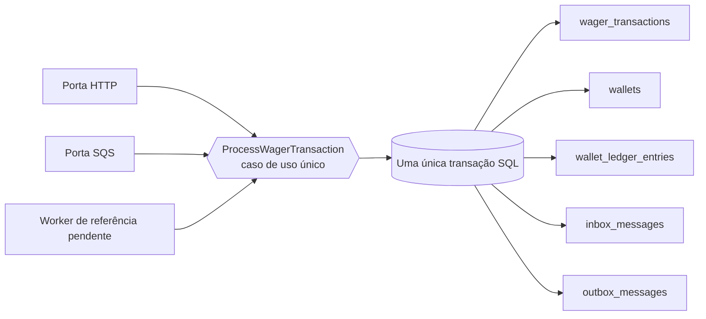
```mermaid
flowchart LR
    HTTP[Porta HTTP] --> UC{{ProcessWagerTransaction<br/>caso de uso único}}
    SQS[Porta SQS] --> UC
    RETRY[Worker de referência pendente] --> UC
    UC --> TX[(Uma única transação SQL)]

    TX --> T1[wager_transactions]
    TX --> T2[wallets]
    TX --> T3[wallet_ledger_entries]
    TX --> T4[inbox_messages]
    TX --> T5[outbox_messages]
```

Três portas de entrada, **uma** implementação de regra de negócio, **uma** unidade
de atomicidade. Duplicar a regra entre HTTP e SQS seria a origem mais provável de
divergência de comportamento entre os canais, e é justamente essa divergência que
produz saldo incorreto sob carga mista.

Quatro invariantes globais governam o desenho inteiro:

1. Nenhum crédito é aplicado duas vezes.
2. Nenhum débito é aplicado duas vezes.
3. Nenhum evento confirmado é perdido.
4. Nenhum saldo fica negativo.

---

## 2. Modelo C4

### 2.1 Nível 1 — Contexto

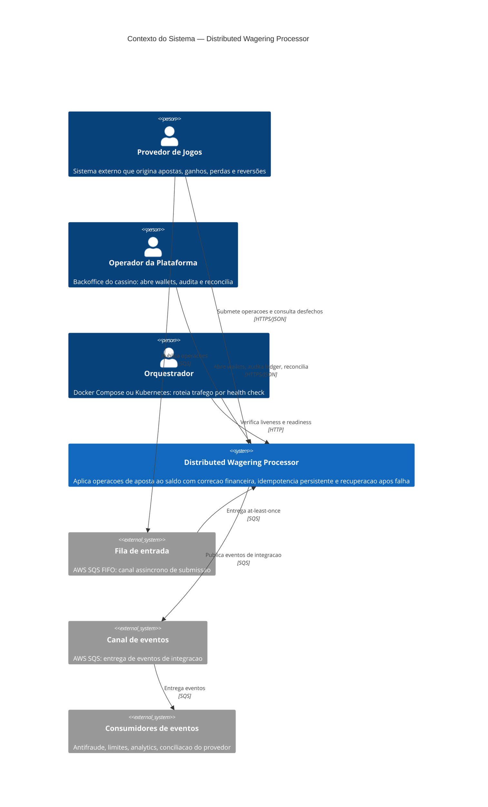
```mermaid
C4Context
    title Contexto do Sistema — Distributed Wagering Processor

    Person(provider, "Provedor de Jogos", "Sistema externo que origina apostas, ganhos, perdas e reversões")
    Person(operator, "Operador da Plataforma", "Backoffice do cassino: abre wallets, audita e reconcilia")
    Person(orchestrator, "Orquestrador", "Docker Compose ou Kubernetes: roteia trafego por health check")

    System(wagering, "Distributed Wagering Processor", "Aplica operacoes de aposta ao saldo com correcao financeira, idempotencia persistente e recuperacao apos falha")

    System_Ext(sqsIn, "Fila de entrada", "AWS SQS FIFO: canal assincrono de submissao")
    System_Ext(sqsOut, "Canal de eventos", "AWS SQS: entrega de eventos de integracao")
    System_Ext(consumers, "Consumidores de eventos", "Antifraude, limites, analytics, conciliacao do provedor")

    Rel(provider, wagering, "Submete operacoes e consulta desfechos", "HTTPS/JSON")
    Rel(provider, sqsIn, "Publica operacoes", "SQS")
    Rel(sqsIn, wagering, "Entrega at-least-once", "SQS")
    Rel(operator, wagering, "Abre wallets, audita ledger, reconcilia", "HTTPS/JSON")
    Rel(orchestrator, wagering, "Verifica liveness e readiness", "HTTP")
    Rel(wagering, sqsOut, "Publica eventos de integracao", "SQS")
    Rel(sqsOut, consumers, "Entrega eventos", "SQS")
```

**Justificativa do recorte.** O provedor aparece duas vezes — como cliente HTTP e
como publicador na fila — porque os dois canais são igualmente legítimos e o
enunciado exige que ambos convirjam para o mesmo caso de uso. Modelá-los como
atores separados esconderia que a idempotência precisa funcionar **entre** canais:
a mesma operação pode chegar por HTTP e por SQS.

### 2.2 Nível 2 — Contêineres

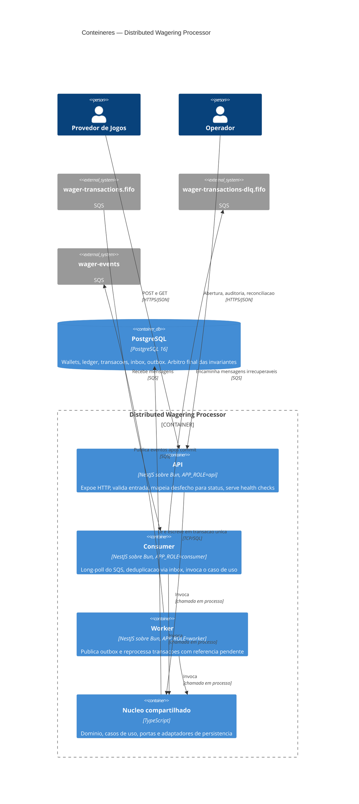
```mermaid
C4Container
    title Conteineres — Distributed Wagering Processor

    Person(provider, "Provedor de Jogos", "")
    Person(operator, "Operador", "")
    System_Ext(sqsIn, "wager-transactions.fifo", "SQS")
    System_Ext(dlq, "wager-transactions-dlq.fifo", "SQS")
    System_Ext(sqsOut, "wager-events", "SQS")

    Container_Boundary(sys, "Distributed Wagering Processor") {
        Container(api, "API", "NestJS sobre Bun, APP_ROLE=api", "Expoe HTTP, valida entrada, mapeia desfecho para status, serve health checks")
        Container(consumer, "Consumer", "NestJS sobre Bun, APP_ROLE=consumer", "Long-poll do SQS, deduplicacao via inbox, invoca o caso de uso")
        Container(worker, "Worker", "NestJS sobre Bun, APP_ROLE=worker", "Publica outbox e reprocessa transacoes com referencia pendente")
        Container(core, "Nucleo compartilhado", "TypeScript", "Dominio, casos de uso, portas e adaptadores de persistencia")
    }

    ContainerDb(pg, "PostgreSQL", "PostgreSQL 16", "Wallets, ledger, transacoes, inbox, outbox. Arbitro final das invariantes")

    Rel(provider, api, "POST e GET", "HTTPS/JSON")
    Rel(operator, api, "Abertura, auditoria, reconciliacao", "HTTPS/JSON")
    Rel(sqsIn, consumer, "Recebe mensagens", "SQS")
    Rel(consumer, dlq, "Encaminha mensagens irrecuperaveis", "SQS")
    Rel(api, core, "Invoca", "chamada em processo")
    Rel(consumer, core, "Invoca", "chamada em processo")
    Rel(worker, core, "Invoca", "chamada em processo")
    Rel(core, pg, "Le e escreve em transacao unica", "TCP/SQL")
    Rel(worker, sqsOut, "Publica eventos apos commit", "SQS")
```

**Justificativa da separação por papel.** Os três contêineres executam a **mesma
imagem**, com o comportamento selecionado por `APP_ROLE`. Isso preserva a garantia
de que existe uma única implementação da regra e ao mesmo tempo permite escalar
cada papel de forma independente — a carga de submissão HTTP e a carga de consumo
de fila não crescem juntas.

A alternativa de um único processo executando os três papéis foi descartada porque
tornaria impossível demonstrar o requisito de correção com três ou mais instâncias
sem que cada instância fosse uma cópia integral do sistema, e porque acoplaria o
ciclo de vida do publicador de eventos ao do servidor HTTP: um `SIGTERM` para
drenar conexões HTTP interromperia a publicação de eventos pendentes.

A alternativa de microsserviços separados por contexto foi descartada porque
fragmentaria a fronteira transacional. Wallet, ledger, inbox e outbox precisam ser
confirmados juntos; separá-los em serviços exigiria coordenação distribuída para
obter uma garantia que uma única transação SQL entrega de graça.

### 2.3 Nível 3 — Componentes do núcleo

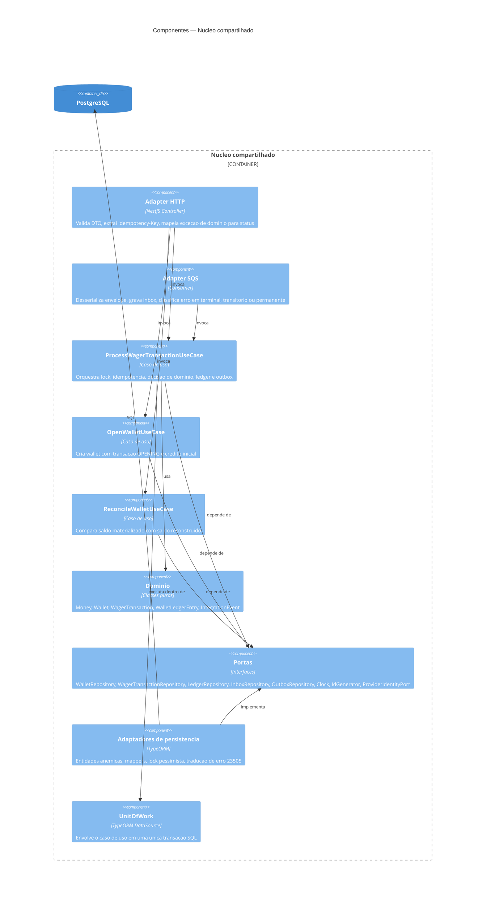
```mermaid
C4Component
    title Componentes — Nucleo compartilhado

    Container_Boundary(core, "Nucleo compartilhado") {
        Component(ctrlHttp, "Adapter HTTP", "NestJS Controller", "Valida DTO, extrai Idempotency-Key, mapeia excecao de dominio para status")
        Component(ctrlSqs, "Adapter SQS", "Consumer", "Desserializa envelope, grava inbox, classifica erro em terminal, transitorio ou permanente")

        Component(ucProcess, "ProcessWagerTransactionUseCase", "Caso de uso", "Orquestra lock, idempotencia, decisao de dominio, ledger e outbox")
        Component(ucOpen, "OpenWalletUseCase", "Caso de uso", "Cria wallet com transacao OPENING e credito inicial")
        Component(ucRecon, "ReconcileWalletUseCase", "Caso de uso", "Compara saldo materializado com saldo reconstruido")

        Component(domain, "Dominio", "Classes puras", "Money, Wallet, WagerTransaction, WalletLedgerEntry, IntegrationEvent")
        Component(ports, "Portas", "Interfaces", "WalletRepository, WagerTransactionRepository, LedgerRepository, InboxRepository, OutboxRepository, Clock, IdGenerator, ProviderIdentityPort")

        Component(repos, "Adaptadores de persistencia", "TypeORM", "Entidades anemicas, mappers, lock pessimista, traducao de erro 23505")
        Component(uow, "UnitOfWork", "TypeORM DataSource", "Envolve o caso de uso em uma unica transacao SQL")
    }

    ContainerDb(pg, "PostgreSQL", "", "")

    Rel(ctrlHttp, ucProcess, "invoca")
    Rel(ctrlSqs, ucProcess, "invoca")
    Rel(ctrlHttp, ucOpen, "invoca")
    Rel(ctrlHttp, ucRecon, "invoca")
    Rel(ucProcess, domain, "usa")
    Rel(ucProcess, ports, "depende de")
    Rel(ucOpen, ports, "depende de")
    Rel(ucRecon, ports, "depende de")
    Rel(repos, ports, "implementa")
    Rel(ucProcess, uow, "executa dentro de")
    Rel(repos, pg, "SQL")
```

**Justificativa da inversão de dependência.** O caso de uso depende de interfaces
declaradas na camada de aplicação; os adaptadores TypeORM as implementam. O domínio
não importa nada de NestJS nem de TypeORM — nenhum decorator, nenhum tipo de coluna,
nenhum `EntityManager`. Isso é verificável mecanicamente e é verificado: uma regra
de lint proíbe importações de `@nestjs/*` e `typeorm` dentro de `src/domain`.

O ganho não é purismo. É que as regras financeiras ficam testáveis sem banco, o que
torna o ciclo de teste do núcleo de risco praticamente instantâneo e permite cobrir
exaustivamente aritmética e transições de estado antes de qualquer infraestrutura
existir.

### 2.4 Nível 4 — Código

O detalhamento de código está no [modelo de domínio](#6-modelo-de-domínio), expresso
como diagrama de classes. Os demais níveis do C4 param aqui deliberadamente: abaixo
do componente, o código é a documentação, e um diagrama que replique assinaturas de
método diverge do código no primeiro refactor.

### 2.5 Estrutura de pastas

```
src/
├── domain/                  # zero dependência externa
│   ├── money/
│   ├── wallet/
│   ├── wager-transaction/
│   ├── ledger/
│   ├── messaging/           # InboxMessage, OutboxMessage
│   ├── events/              # IntegrationEvent + subclasses concretas
│   └── errors/              # DomainError, FailureCode
├── application/
│   ├── use-cases/
│   ├── ports/               # interfaces de repositório e serviços
│   └── dto/
├── infrastructure/
│   ├── persistence/
│   │   ├── entities/        # entidades TypeORM anêmicas
│   │   ├── mappers/         # entidade ↔ domínio
│   │   ├── repositories/
│   │   └── migrations/
│   ├── messaging/           # SqsClient, publisher, consumer
│   ├── observability/       # logger, métricas, tracing
│   └── config/
├── interface/
│   └── http/                # controllers, DTOs, filtros de exceção, Swagger
└── workers/                 # consumer SQS, outbox publisher, pending-reference retrier
```

---

## 3. Requisitos funcionais

| ID | Requisito | Origem |
|---|---|---|
| RF-001 | Criar wallet para um jogador em uma moeda, com saldo inicial opcional | Seção 9 do desafio |
| RF-002 | Gerar transação interna `OPENING` e lançamento `CREDIT` quando o saldo inicial for maior que zero, na mesma transação SQL | Seção 9 |
| RF-003 | Rejeitar criação de wallet duplicada para o mesmo `playerId` e moeda | Seção 6.2 |
| RF-004 | Consultar saldo e versão corrente de uma wallet | Seção 9 |
| RF-005 | Consultar o ledger de uma wallet com paginação por cursor estável e opaco | Seção 9 |
| RF-006 | Submeter operação de aposta por HTTP com header `Idempotency-Key` obrigatório | Seção 9 |
| RF-007 | Submeter operação por mensagem SQS, reutilizando o mesmo caso de uso | Seção 10 |
| RF-008 | Aplicar `BET` como débito, rejeitando quando o saldo for insuficiente | Seção 7 |
| RF-009 | Aplicar `WIN` como crédito, com referência opcional à `BET` da rodada | Seção 7 |
| RF-010 | Registrar `LOSS` sem alterar saldo e sem gerar lançamento no ledger | Seção 7 |
| RF-011 | Aplicar `REFUND` como crédito, revertendo uma `BET` `PROCESSED` uma única vez | Seção 7 |
| RF-012 | Aplicar `ROLLBACK` com direção inversa à da referência, uma única vez | Seção 7 |
| RF-013 | Exigir `referenceExternalTransactionId` em `REFUND` e `ROLLBACK` | Seção 7.1 |
| RF-014 | Resolver a referência por `(providerId, referenceExternalTransactionId)`, exigindo coincidência de provider, player, wallet, moeda e rodada | Seção 7.2 |
| RF-015 | Exigir que o valor da reversão seja igual ao valor da referência | Seção 7.5 |
| RF-016 | Persistir como `PENDING_REFERENCE` quando a referência ainda não existir, e reprocessar posteriormente | Seção 7.8 |
| RF-017 | Rejeitar com `failureCode` específico quando o limite de reprocessamento por referência ausente se esgotar | Seção 7.1 |
| RF-018 | Rejeitar reversão que produziria saldo negativo com `failureCode` distinto do de aposta sem saldo | Seção 7.9 |
| RF-019 | Devolver o resultado original, incluindo o saldo observado na ocasião, ao repetir operação já processada | Seção 7.7 |
| RF-020 | Tratar a mesma idempotency key com payload divergente como conflito, nunca como replay | Seção 6.3 |
| RF-021 | Impedir que `OPENING` seja submetido pela API ou pela fila | Seção 6.3 |
| RF-022 | Consultar transação por identificador interno e por `(providerId, externalTransactionId)` | Seção 9 |
| RF-023 | Reconciliar wallet comparando saldo materializado com saldo reconstruído pelo ledger | Seção 9 |
| RF-024 | Sinalizar, logar e contabilizar divergência de reconciliação sem corrigi-la automaticamente | Seção 9 |
| RF-025 | Deduplicar mensagens de entrada por `(consumerName, messageId)` em inbox persistente | Seção 10 |
| RF-026 | Confirmar a mensagem no SQS somente após o commit da transação | Seção 10 |
| RF-027 | Distinguir erro de negócio, erro transitório e erro permanente no consumo | Seção 10 |
| RF-028 | Encaminhar mensagem à DLQ após o limite de tentativas | Seção 10 |
| RF-029 | Concluir ou devolver a visibilidade das mensagens em andamento ao receber `SIGTERM` | Seção 10 |
| RF-030 | Registrar eventos de integração na mesma transação do efeito financeiro | Seção 11 |
| RF-031 | Publicar eventos pendentes por worker, tolerando múltiplos publishers concorrentes | Seção 11 |
| RF-032 | Emitir `WagerTransactionProcessed`, `WagerTransactionRejected`, `WalletBalanceChanged` e `WagerTransactionPendingReference` conforme o desfecho | Seção 11 |
| RF-033 | Emitir `WalletBalanceChanged` exclusivamente quando o saldo mudar | Seção 11 |
| RF-034 | Expor `GET /health/live` e `GET /health/ready` sem autenticação | Seção 9 |

---

## 4. Requisitos não funcionais

### 4.1 Correção financeira

| ID | Requisito | Verificação |
|---|---|---|
| RNF-001 | Nenhum valor monetário é representado por `number`, `float` ou `double` em qualquer camada, incluindo o driver | Teste que consulta pelo driver cru e assere `typeof === 'string'` |
| RNF-002 | Toda quantia tem escala fixa de 2 casas decimais | Testes unitários de `Money` |
| RNF-003 | `wallet.balance` é sempre igual a `SUM(CREDIT) − SUM(DEBIT)` do ledger | Assertion final de todo teste de integração e concorrência |
| RNF-004 | Saldo nunca negativo, garantido por `CHECK` no schema além da regra de domínio | Teste que tenta violar a constraint diretamente |
| RNF-005 | Lançamentos do ledger não podem ser alterados nem excluídos | `RULE` no PostgreSQL, verificada por teste |

### 4.2 Concorrência

| ID | Requisito | Valor |
|---|---|---|
| RNF-006 | Correção preservada com três ou mais instâncias simultâneas de cada papel | obrigatório |
| RNF-007 | Wallets distintas processam em paralelo sem contenção mútua | zero espera cruzada |
| RNF-008 | A mesma operação enviada 50 vezes em paralelo produz exatamente um lançamento | 1 lançamento |
| RNF-009 | Nenhum lock global compartilhado entre wallets | verificado por revisão e por teste de paralelismo |
| RNF-010 | Ausência de deadlock entre transações financeiras | garantida por desenho: cada transação trava uma única wallet |

### 4.3 Desempenho

| ID | Operação | Métrica | Valor | Percentil |
|---|---|---|---|---|
| RNF-011 | Submissão de operação, wallets distribuídas | latência | ≤ 300 ms | p95 |
| RNF-012 | Submissão de operação, wallets distribuídas | latência | ≤ 800 ms | p99 |
| RNF-013 | Submissão em wallet única sob contenção | latência | ≤ 1500 ms | p95 |
| RNF-014 | Consulta de saldo | latência | ≤ 40 ms | p95 |
| RNF-015 | Página de ledger com 50 itens sobre 1 milhão de lançamentos | latência | ≤ 150 ms | p95 |
| RNF-016 | Outbox lag em regime normal | commit até publicação | ≤ 2 s | p95 |
| RNF-017 | Outbox lag após restabelecimento do canal | commit até publicação | ≤ 30 s | p99 |
| RNF-018 | Health check | latência | ≤ 50 ms | p99 |

> Os valores de latência são alvos de calibração, derivados de uma premissa de porte
> médio e não de volume informado. São recalibrados após a primeira execução do teste
> de carga e o valor final observado é registrado em `LOAD-TEST.md`.

### 4.4 Confiabilidade

| ID | Requisito |
|---|---|
| RNF-019 | Commit seguido de morte do processo antes da publicação não perde o evento |
| RNF-020 | Redelivery de mensagem já processada não produz efeito adicional |
| RNF-021 | Reinício completo do serviço preserva a consistência final |
| RNF-022 | Publicação duplicada de evento permanece segura para o consumidor, via `eventId` estável |
| RNF-023 | Indisponibilidade temporária de PostgreSQL ou SQS não corrompe estado |

### 4.5 Observabilidade

| ID | Requisito |
|---|---|
| RNF-024 | Logs estruturados em JSON com `correlationId`, `messageId`, `transactionId`, `walletId`, `providerId` |
| RNF-025 | Nenhum dado sensível ou payload financeiro completo em log |
| RNF-026 | Métricas de transações por status, duplicatas, retries, DLQ, conflitos de lock, outbox lag e latência |
| RNF-027 | `correlationId` propagado da entrada até o evento publicado |
| RNF-028 | Liveness e readiness expostos separadamente |

### 4.6 Manutenibilidade

| ID | Requisito |
|---|---|
| RNF-029 | Domínio sem importação de framework ou ORM, verificado por regra de lint |
| RNF-030 | Migrations versionadas e reversíveis |
| RNF-031 | TypeScript em modo estrito, sem `any` implícito |
| RNF-032 | Testes de integração executam contra PostgreSQL e SQS reais em containers |

---

## 5. User stories

| ID | Como | Quero | Para | Critério de aceite |
|---|---|---|---|---|
| US-001 | operador | abrir wallet com saldo inicial | permitir que o jogador aposte | wallet criada com `version: 1` e lançamento `CREDIT` de abertura no ledger |
| US-002 | operador | receber conflito ao abrir wallet duplicada | evitar saldo fragmentado | segunda tentativa falha com `409`, wallet original intacta |
| US-003 | provedor | consultar saldo de uma wallet | decidir se autorizo a aposta | saldo e versão retornados em tempo constante |
| US-004 | operador | consultar o ledger paginado | auditar movimentação | cursor opaco e estável, sem repetir nem pular lançamentos |
| US-005 | provedor | registrar `BET` | debitar o valor apostado | saldo reduzido, um lançamento `DEBIT`, eventos registrados |
| US-006 | provedor | ser rejeitado quando o saldo é insuficiente | não gerar crédito indevido | `422` com `INSUFFICIENT_FUNDS`, saldo intacto, sem lançamento |
| US-007 | provedor | registrar `WIN` | creditar o prêmio | saldo aumentado, um lançamento `CREDIT` |
| US-008 | provedor | registrar `LOSS` | fechar a rodada | operação `PROCESSED`, saldo intacto, sem lançamento, sem `WalletBalanceChanged` |
| US-009 | provedor | estornar uma `BET` | devolver o valor ao jogador | crédito de valor igual à referência, uma única vez |
| US-010 | provedor | reverter uma operação aplicada | corrigir erro operacional | lançamento invertido, uma única vez |
| US-011 | provedor | ser rejeitado ao reverter duas vezes | evitar crédito duplicado | `422` com `REFERENCE_ALREADY_REVERSED` |
| US-012 | provedor | ser rejeitado quando a reversão deixaria saldo negativo | separar erro operacional de fluxo normal | `422` com `REVERSAL_WOULD_OVERDRAW`, distinto de `INSUFFICIENT_FUNDS` |
| US-013 | provedor | reenviar operação após timeout | tolerar falha de rede | `200` com `idempotentReplay: true` e o saldo original |
| US-014 | provedor | receber conflito ao reusar chave com payload diferente | detectar erro de integração | `409` com `IDEMPOTENCY_PAYLOAD_CONFLICT`, sem nova transação |
| US-015 | provedor | enviar operações por SQS | não depender de resposta síncrona | operação aplicada uma única vez, `ack` após o commit |
| US-016 | provedor | enviar reversão antes da referência | não depender da ordem de entrega | `202` com `PENDING_REFERENCE`, aplicada quando a referência chegar |
| US-017 | provedor | receber desfecho definitivo quando a referência nunca chega | encerrar a conciliação | `REJECTED` com `REFERENCE_NOT_FOUND` após o limite |
| US-018 | operador | localizar transação pelo id do provedor | conciliar sistemas | busca por `(providerId, externalTransactionId)` |
| US-019 | operador | reconciliar uma wallet | detectar divergência | comparação retornada, divergência logada e contabilizada, nunca corrigida |
| US-020 | orquestrador | verificar liveness e readiness | rotear tráfego corretamente | readiness falha quando PostgreSQL ou SQS estão inacessíveis, liveness continua respondendo |
| US-021 | consumidor de eventos | receber eventos após o commit | reagir a fatos reais | nenhum evento publicado antes da confirmação da transação |
| US-022 | operador | que eventos sobrevivam à morte do processo | não perder integração | outra instância publica o evento pendente |

---

## 6. Modelo de domínio

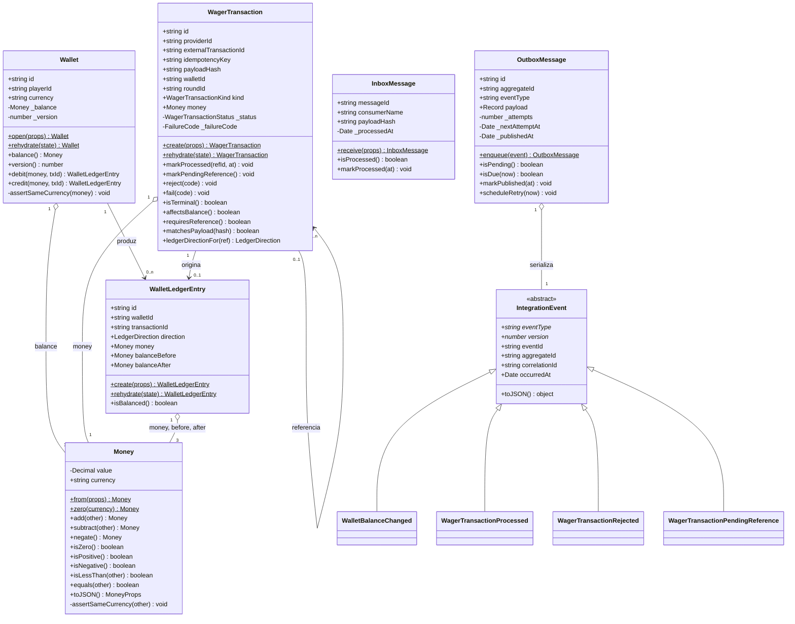
```mermaid
classDiagram
    class Money {
        -Decimal value
        +string currency
        +from(props) Money$
        +zero(currency) Money$
        +add(other) Money
        +subtract(other) Money
        +negate() Money
        +isZero() boolean
        +isPositive() boolean
        +isNegative() boolean
        +isLessThan(other) boolean
        +equals(other) boolean
        +toJSON() MoneyProps
        -assertSameCurrency(other) void
    }

    class Wallet {
        +string id
        +string playerId
        +string currency
        -Money _balance
        -number _version
        +open(props) Wallet$
        +rehydrate(state) Wallet$
        +balance() Money
        +version() number
        +debit(money, txId) WalletLedgerEntry
        +credit(money, txId) WalletLedgerEntry
        -assertSameCurrency(money) void
    }

    class WagerTransaction {
        +string id
        +string providerId
        +string externalTransactionId
        +string idempotencyKey
        +string payloadHash
        +string walletId
        +string roundId
        +WagerTransactionKind kind
        +Money money
        -WagerTransactionStatus _status
        -FailureCode _failureCode
        +create(props) WagerTransaction$
        +rehydrate(state) WagerTransaction$
        +markProcessed(refId, at) void
        +markPendingReference() void
        +reject(code) void
        +fail(code) void
        +isTerminal() boolean
        +affectsBalance() boolean
        +requiresReference() boolean
        +matchesPayload(hash) boolean
        +ledgerDirectionFor(ref) LedgerDirection
    }

    class WalletLedgerEntry {
        +string id
        +string walletId
        +string transactionId
        +LedgerDirection direction
        +Money money
        +Money balanceBefore
        +Money balanceAfter
        +create(props) WalletLedgerEntry$
        +rehydrate(state) WalletLedgerEntry$
        +isBalanced() boolean
    }

    class InboxMessage {
        +string messageId
        +string consumerName
        +string payloadHash
        -Date _processedAt
        +receive(props) InboxMessage$
        +isProcessed() boolean
        +markProcessed(at) void
    }

    class OutboxMessage {
        +string id
        +string aggregateId
        +string eventType
        +Record payload
        -number _attempts
        -Date _nextAttemptAt
        -Date _publishedAt
        +enqueue(event) OutboxMessage$
        +isPending() boolean
        +isDue(now) boolean
        +markPublished(at) void
        +scheduleRetry(now) void
    }

    class IntegrationEvent {
        <<abstract>>
        +string eventType*
        +number version*
        +string eventId
        +string aggregateId
        +string correlationId
        +Date occurredAt
        +toJSON() object
    }

    Wallet "1" o-- "1" Money : balance
    Wallet "1" --> "0..n" WalletLedgerEntry : produz
    WagerTransaction "1" o-- "1" Money : money
    WagerTransaction "1" --> "0..1" WalletLedgerEntry : origina
    WagerTransaction "0..1" --> "0..n" WagerTransaction : referencia
    WalletLedgerEntry "1" o-- "3" Money : money, before, after
    IntegrationEvent <|-- WalletBalanceChanged
    IntegrationEvent <|-- WagerTransactionProcessed
    IntegrationEvent <|-- WagerTransactionRejected
    IntegrationEvent <|-- WagerTransactionPendingReference
    OutboxMessage "1" o-- "1" IntegrationEvent : serializa
```

**Justificativa do encapsulamento.** Construtores são privados e a construção passa
por factories estáticas: `create` e `open` validam regras de nascimento, `rehydrate`
reconstrói estado já persistido sem revalidar transições.

A separação entre `create` e `rehydrate` não é cosmética. Revalidar transições na
leitura transformaria uma inconsistência histórica em impossibilidade de ler a linha —
exatamente no momento em que a leitura é necessária para diagnosticar a
inconsistência. Estado gravado é fato consumado; a validação pertence à escrita.

`WalletLedgerEntry` não tem nenhum campo mutável nem método de transição. A
imutabilidade é estrutural, não convenção — não existe método a ser chamado por
engano.

---

## 7. Máquinas de estado

### 7.1 WagerTransaction

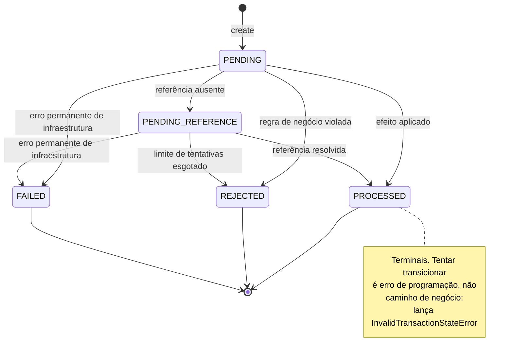
```mermaid
stateDiagram-v2
    [*] --> PENDING : create

    PENDING --> PROCESSED : efeito aplicado
    PENDING --> REJECTED : regra de negócio violada
    PENDING --> PENDING_REFERENCE : referência ausente
    PENDING --> FAILED : erro permanente de infraestrutura

    PENDING_REFERENCE --> PROCESSED : referência resolvida
    PENDING_REFERENCE --> REJECTED : limite de tentativas esgotado
    PENDING_REFERENCE --> FAILED : erro permanente de infraestrutura

    PROCESSED --> [*]
    REJECTED --> [*]
    FAILED --> [*]

    note right of PROCESSED
        Terminais. Tentar transicionar
        é erro de programação, não
        caminho de negócio:
        lança InvalidTransactionStateError
    end note
```

**Justificativa dos três terminais distintos.** `REJECTED` e `FAILED` poderiam ter
sido colapsados, mas significam coisas operacionalmente opostas. `REJECTED` é o
sistema funcionando: a regra de negócio recusou e o provedor não deve reenviar.
`FAILED` é o sistema falhando de forma permanente e exige inspeção humana. Colapsá-los
obrigaria a inspecionar `failureCode` para saber se há incidente, e alarmes baseados
em contagem de status ficariam inúteis.

### 7.2 OutboxMessage

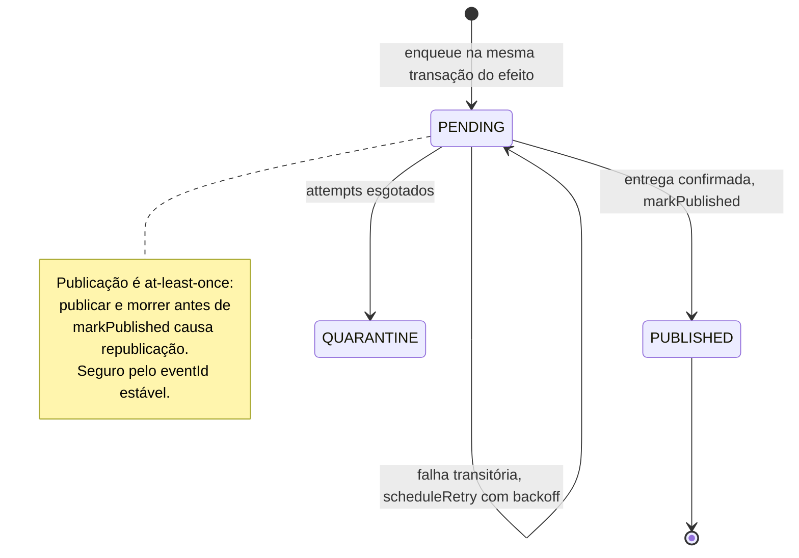
```mermaid
stateDiagram-v2
    [*] --> PENDING : enqueue na mesma transação do efeito
    PENDING --> PENDING : falha transitória, scheduleRetry com backoff
    PENDING --> PUBLISHED : entrega confirmada, markPublished
    PENDING --> QUARANTINE : attempts esgotados
    PUBLISHED --> [*]

    note right of PENDING
        Publicação é at-least-once:
        publicar e morrer antes de
        markPublished causa republicação.
        Seguro pelo eventId estável.
    end note
```

### 7.3 Ciclo de vida da rodada

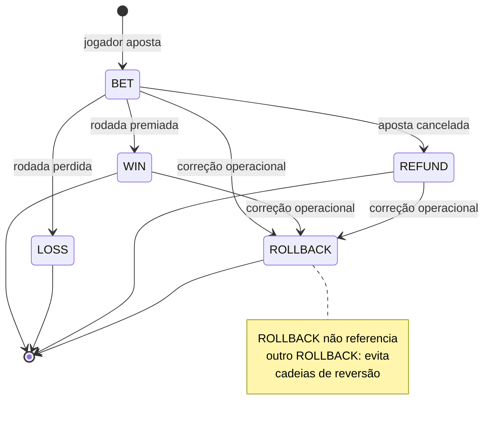
```mermaid
stateDiagram-v2
    [*] --> BET : jogador aposta

    BET --> WIN : rodada premiada
    BET --> LOSS : rodada perdida
    BET --> REFUND : aposta cancelada
    BET --> ROLLBACK : correção operacional

    WIN --> ROLLBACK : correção operacional
    REFUND --> ROLLBACK : correção operacional

    WIN --> [*]
    LOSS --> [*]
    REFUND --> [*]
    ROLLBACK --> [*]

    note right of ROLLBACK
        ROLLBACK não referencia
        outro ROLLBACK: evita
        cadeias de reversão
    end note
```

---

## 8. Schema e invariantes no banco

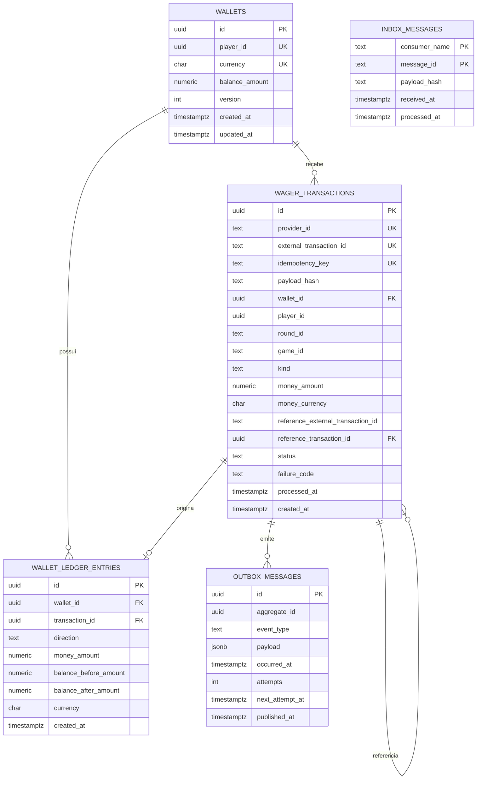
```mermaid
erDiagram
    WALLETS ||--o{ WALLET_LEDGER_ENTRIES : "possui"
    WALLETS ||--o{ WAGER_TRANSACTIONS : "recebe"
    WAGER_TRANSACTIONS ||--o| WALLET_LEDGER_ENTRIES : "origina"
    WAGER_TRANSACTIONS ||--o{ WAGER_TRANSACTIONS : "referencia"
    WAGER_TRANSACTIONS ||--o{ OUTBOX_MESSAGES : "emite"

    WALLETS {
        uuid id PK
        uuid player_id UK
        char currency UK
        numeric balance_amount
        int version
        timestamptz created_at
        timestamptz updated_at
    }

    WAGER_TRANSACTIONS {
        uuid id PK
        text provider_id UK
        text external_transaction_id UK
        text idempotency_key UK
        text payload_hash
        uuid wallet_id FK
        uuid player_id
        text round_id
        text game_id
        text kind
        numeric money_amount
        char money_currency
        text reference_external_transaction_id
        uuid reference_transaction_id FK
        text status
        text failure_code
        timestamptz processed_at
        timestamptz created_at
    }

    WALLET_LEDGER_ENTRIES {
        uuid id PK
        uuid wallet_id FK
        uuid transaction_id FK
        text direction
        numeric money_amount
        numeric balance_before_amount
        numeric balance_after_amount
        char currency
        timestamptz created_at
    }

    INBOX_MESSAGES {
        text consumer_name PK
        text message_id PK
        text payload_hash
        timestamptz received_at
        timestamptz processed_at
    }

    OUTBOX_MESSAGES {
        uuid id PK
        uuid aggregate_id
        text event_type
        jsonb payload
        timestamptz occurred_at
        int attempts
        timestamptz next_attempt_at
        timestamptz published_at
    }
```

### 8.1 Constraints

O enunciado exige que unicidade, imutabilidade e não-negatividade sejam aplicadas
**no schema**, não apenas em código. A razão é direta: código de aplicação é
executado por N instâncias sem coordenação entre si, e uma verificação em memória
não vale nada sob concorrência real.

```sql
-- wallets
ALTER TABLE wallets ADD CONSTRAINT uq_wallet_player_currency
  UNIQUE (player_id, currency);
ALTER TABLE wallets ADD CONSTRAINT ck_wallet_balance_non_negative
  CHECK (balance_amount >= 0);
ALTER TABLE wallets ADD CONSTRAINT ck_wallet_version_positive
  CHECK (version >= 1);

-- wager_transactions
ALTER TABLE wager_transactions ADD CONSTRAINT uq_tx_provider_idempotency
  UNIQUE (provider_id, idempotency_key);
ALTER TABLE wager_transactions ADD CONSTRAINT uq_tx_provider_external
  UNIQUE (provider_id, external_transaction_id);
ALTER TABLE wager_transactions ADD CONSTRAINT ck_tx_money_positive
  CHECK (money_amount > 0);
ALTER TABLE wager_transactions ADD CONSTRAINT ck_tx_reference_required
  CHECK (kind NOT IN ('REFUND','ROLLBACK')
         OR reference_external_transaction_id IS NOT NULL);
ALTER TABLE wager_transactions ADD CONSTRAINT ck_tx_failure_code_on_terminal
  CHECK (status NOT IN ('REJECTED','FAILED') OR failure_code IS NOT NULL);

-- uma referência não pode ser revertida duas vezes pelo mesmo tipo
CREATE UNIQUE INDEX uq_reversal_per_reference
  ON wager_transactions (reference_transaction_id, kind)
  WHERE status = 'PROCESSED' AND kind IN ('REFUND','ROLLBACK');

-- wallet_ledger_entries
ALTER TABLE wallet_ledger_entries ADD CONSTRAINT uq_ledger_tx_wallet
  UNIQUE (transaction_id, wallet_id);
ALTER TABLE wallet_ledger_entries ADD CONSTRAINT ck_ledger_money_positive
  CHECK (money_amount > 0);
ALTER TABLE wallet_ledger_entries ADD CONSTRAINT ck_ledger_balance_non_negative
  CHECK (balance_after_amount >= 0 AND balance_before_amount >= 0);
ALTER TABLE wallet_ledger_entries ADD CONSTRAINT ck_ledger_arithmetic
  CHECK (
    (direction = 'CREDIT' AND balance_after_amount = balance_before_amount + money_amount)
    OR
    (direction = 'DEBIT'  AND balance_after_amount = balance_before_amount - money_amount)
  );

-- imutabilidade estrutural do ledger
CREATE RULE ledger_no_update AS ON UPDATE TO wallet_ledger_entries DO INSTEAD NOTHING;
CREATE RULE ledger_no_delete AS ON DELETE TO wallet_ledger_entries DO INSTEAD NOTHING;

-- inbox
ALTER TABLE inbox_messages ADD CONSTRAINT pk_inbox
  PRIMARY KEY (consumer_name, message_id);

-- outbox: índice parcial para o polling do publisher
CREATE INDEX ix_outbox_pending
  ON outbox_messages (next_attempt_at NULLS FIRST, occurred_at)
  WHERE published_at IS NULL;

-- ledger: índice para paginação por cursor
CREATE INDEX ix_ledger_wallet_cursor
  ON wallet_ledger_entries (wallet_id, created_at DESC, id DESC);
```

**Justificativa do `CHECK` de aritmética.** É a constraint mais incomum do schema e a
mais valiosa. Ela torna estruturalmente impossível gravar um lançamento
desbalanceado, mesmo com bug na aplicação. Sem ela, a garantia
`balanceBefore ± money = balanceAfter` depende de a factory ter sido chamada
corretamente; com ela, depende do PostgreSQL.

**Justificativa do índice parcial único de reversão.** A regra "uma referência não é
revertida duas vezes pelo mesmo tipo" poderia viver em `if` no caso de uso. Sob duas
reversões concorrentes da mesma referência, o `if` falha: ambas leem "não revertida"
e ambas gravam. O índice parcial resolve porque a unicidade é avaliada no commit, e a
cláusula `WHERE status = 'PROCESSED'` permite que tentativas rejeitadas coexistam.

**Justificativa das `RULE` em vez de `TRIGGER`.** `DO INSTEAD NOTHING` descarta a
operação silenciosamente e sem custo de execução por linha. Um trigger que levanta
exceção seria mais explícito, mas transformaria um `UPDATE` acidental de rotina de
manutenção em falha de transação inteira. Aqui o objetivo é que o ledger seja
inalterável, não que a alteração seja ruidosa — e o teste verifica que a linha
permanece idêntica após a tentativa.

### 8.2 Money na persistência

Colunas separadas: `*_amount NUMERIC(19,2)` e `*_currency CHAR(3)`.

O driver `pg` devolve `NUMERIC` como **string** — não há parser registrado para o OID
1700, precisamente para preservar precisão. O risco real não é o driver converter;
é alguém "consertar" a string. Três vetores concretos:

1. Um `transformer` do TypeORM aplicando `parseFloat` no `from`.
2. Um `pg.types.setTypeParser(1700, parseFloat)` copiado de referência externa.
3. Declarar a coluna como `double precision` ou `real` na migration — este é o único
   que entrega `number` de fato, e é silencioso.

Mitigação: `NUMERIC(19,2)` explícito, transformer que apenas repassa a string ao
`Money.from`, e teste que consulta pelo driver cru e assere o tipo.

---

## 9. Diagramas de sequência

### 9.1 BET aplicada com sucesso via HTTP

```mermaid
sequenceDiagram
    autonumber
    participant P as Provedor
    participant C as HTTP Controller
    participant U as ProcessWagerTransactionUseCase
    participant DB as PostgreSQL
    participant W as Outbox Worker
    participant Q as SQS eventos

    P->>C: POST /wagering/transactions<br/>Idempotency-Key: provider-a:tx-123
    C->>C: valida DTO, calcula payloadHash
    C->>U: execute(command)

    U->>DB: BEGIN
    U->>DB: INSERT wager_transactions (PENDING)
    Note over U,DB: insert-first: a unique constraint<br/>é a fonte da verdade, não um SELECT prévio
    DB-->>U: ok

    U->>DB: SELECT * FROM wallets WHERE id = $1 FOR UPDATE
    Note over U,DB: serializa apenas esta wallet;<br/>outras wallets seguem em paralelo
    DB-->>U: wallet balance=1000.00 version=3

    U->>U: wallet.debit(Money 25.00) → LedgerEntry
    U->>DB: UPDATE wallets SET balance=975.00, version=4
    U->>DB: INSERT wallet_ledger_entries (DEBIT, 1000.00 → 975.00)
    U->>DB: UPDATE wager_transactions SET status=PROCESSED
    U->>DB: INSERT outbox_messages (WagerTransactionProcessed)
    U->>DB: INSERT outbox_messages (WalletBalanceChanged)
    U->>DB: COMMIT
    Note over U,DB: transação, saldo, ledger e eventos<br/>confirmados atomicamente
    DB-->>U: ok

    U-->>C: PROCESSED, balance 975.00
    C-->>P: 201 Created

    W->>DB: SELECT ... WHERE published_at IS NULL FOR UPDATE SKIP LOCKED
    DB-->>W: 2 eventos
    W->>Q: SendMessageBatch
    Q-->>W: ok
    W->>DB: UPDATE outbox SET published_at = now()
```

**Ponto crítico do diagrama.** O evento nunca é publicado dentro da transação. O
worker só enxerga o registro depois do commit, o que torna estruturalmente impossível
publicar um evento referente a uma transação que foi revertida.

### 9.2 BET rejeitada por saldo insuficiente

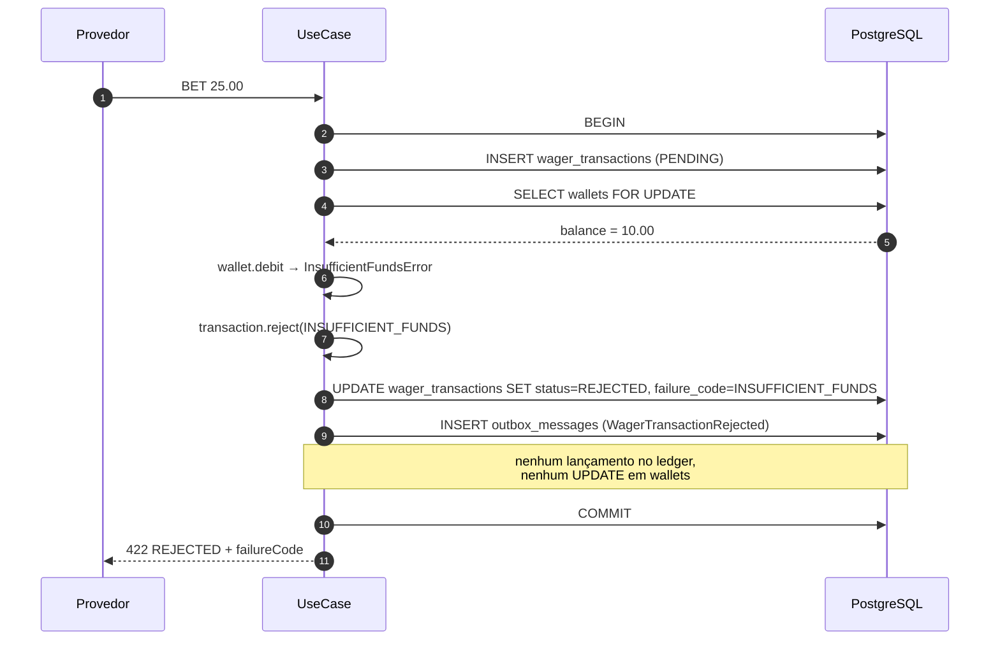
```mermaid
sequenceDiagram
    autonumber
    participant P as Provedor
    participant U as UseCase
    participant DB as PostgreSQL

    P->>U: BET 25.00
    U->>DB: BEGIN
    U->>DB: INSERT wager_transactions (PENDING)
    U->>DB: SELECT wallets FOR UPDATE
    DB-->>U: balance = 10.00
    U->>U: wallet.debit → InsufficientFundsError
    U->>U: transaction.reject(INSUFFICIENT_FUNDS)
    U->>DB: UPDATE wager_transactions SET status=REJECTED, failure_code=INSUFFICIENT_FUNDS
    U->>DB: INSERT outbox_messages (WagerTransactionRejected)
    Note over U,DB: nenhum lançamento no ledger,<br/>nenhum UPDATE em wallets
    U->>DB: COMMIT
    U-->>P: 422 REJECTED + failureCode
```

**Justificativa do commit em caminho de rejeição.** A rejeição é persistida, não
descartada. Isso permite que o replay da mesma idempotency key devolva a mesma
rejeição, que o provedor consulte o desfecho, e que a rejeição seja auditável. Um
`ROLLBACK` da transação SQL aqui apagaria o registro e faria o reenvio ser tratado
como operação nova.

### 9.3 Replay idempotente e conflito de payload

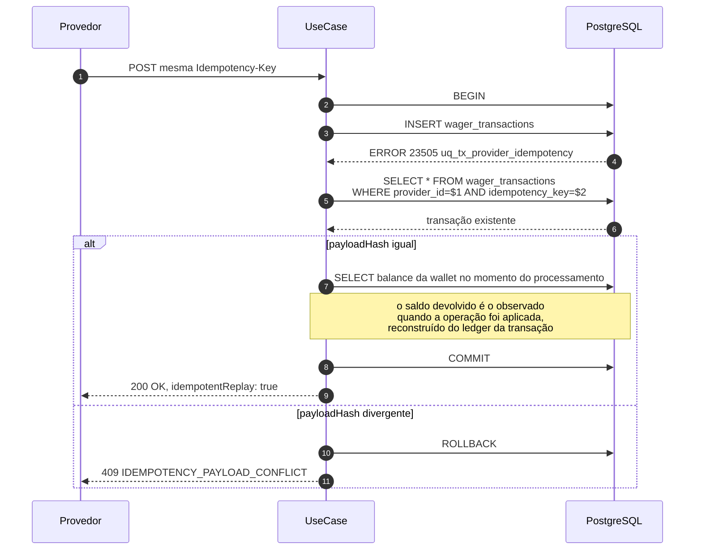
```mermaid
sequenceDiagram
    autonumber
    participant P as Provedor
    participant U as UseCase
    participant DB as PostgreSQL

    P->>U: POST mesma Idempotency-Key
    U->>DB: BEGIN
    U->>DB: INSERT wager_transactions
    DB-->>U: ERROR 23505 uq_tx_provider_idempotency

    U->>DB: SELECT * FROM wager_transactions<br/>WHERE provider_id=$1 AND idempotency_key=$2
    DB-->>U: transação existente

    alt payloadHash igual
        U->>DB: SELECT balance da wallet no momento do processamento
        Note over U,DB: o saldo devolvido é o observado<br/>quando a operação foi aplicada,<br/>reconstruído do ledger da transação
        U->>DB: COMMIT
        U-->>P: 200 OK, idempotentReplay: true
    else payloadHash divergente
        U->>DB: ROLLBACK
        U-->>P: 409 IDEMPOTENCY_PAYLOAD_CONFLICT
    end
```

**Justificativa do insert-first.** Um `SELECT` antes do `INSERT` cria uma janela
TOCTOU: duas instâncias leem "não existe" e ambas inserem. A unique constraint é
avaliada no momento da escrita e não tem janela. O erro `23505` deixa de ser
excepcional e passa a ser um caminho de negócio esperado — o caminho do replay.

**Justificativa do saldo histórico no replay.** O enunciado exige devolver "o
resultado original, incluindo o saldo observado naquele momento". Devolver o saldo
atual seria mais simples e estaria errado: entre a operação original e o replay
outras operações podem ter ocorrido, e o provedor concluiria que sua aposta produziu
um saldo que ela não produziu. O valor correto é `balanceAfter` do lançamento
originado por aquela transação.

### 9.4 Duas apostas concorrentes sobre a mesma wallet

Cenário obrigatório: saldo 100.00, duas apostas de 80.00 simultâneas.

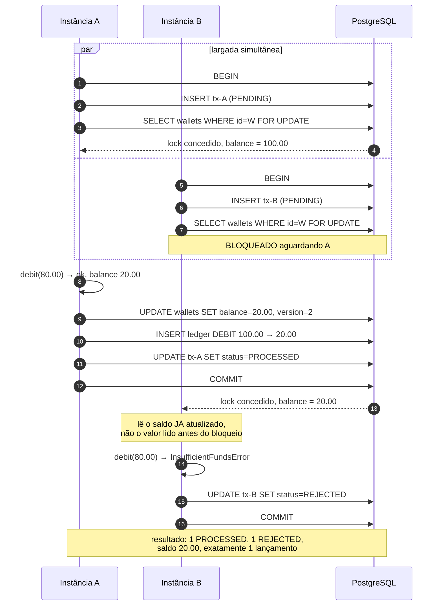
```mermaid
sequenceDiagram
    autonumber
    participant A as Instância A
    participant B as Instância B
    participant DB as PostgreSQL

    par largada simultânea
        A->>DB: BEGIN
        A->>DB: INSERT tx-A (PENDING)
        A->>DB: SELECT wallets WHERE id=W FOR UPDATE
        DB-->>A: lock concedido, balance = 100.00
    and
        B->>DB: BEGIN
        B->>DB: INSERT tx-B (PENDING)
        B->>DB: SELECT wallets WHERE id=W FOR UPDATE
        Note over B,DB: BLOQUEADO aguardando A
    end

    A->>A: debit(80.00) → ok, balance 20.00
    A->>DB: UPDATE wallets SET balance=20.00, version=2
    A->>DB: INSERT ledger DEBIT 100.00 → 20.00
    A->>DB: UPDATE tx-A SET status=PROCESSED
    A->>DB: COMMIT

    DB-->>B: lock concedido, balance = 20.00
    Note over B: lê o saldo JÁ atualizado,<br/>não o valor lido antes do bloqueio
    B->>B: debit(80.00) → InsufficientFundsError
    B->>DB: UPDATE tx-B SET status=REJECTED
    B->>DB: COMMIT

    Note over A,DB: resultado: 1 PROCESSED, 1 REJECTED,<br/>saldo 20.00, exatamente 1 lançamento
```

**Por que não há lost update.** O `FOR UPDATE` não apenas bloqueia: ao ser liberado,
a linha é relida em sua versão mais recente. B não opera sobre o snapshot que existia
quando entrou na fila — opera sobre o saldo pós-commit de A. Um `SELECT` sem `FOR
UPDATE` seguido de `UPDATE` produziria o clássico lost update, com as duas apostas
aprovadas e saldo −60.00.

### 9.5 Consumo de SQS com inbox

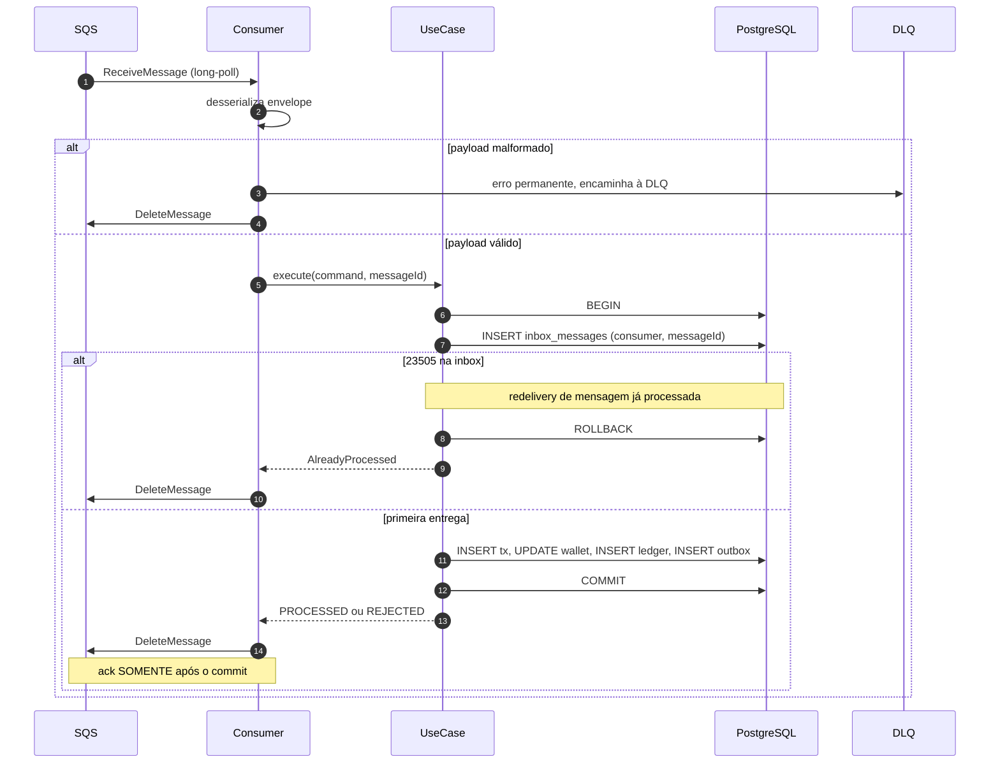
```mermaid
sequenceDiagram
    autonumber
    participant Q as SQS
    participant C as Consumer
    participant U as UseCase
    participant DB as PostgreSQL
    participant D as DLQ

    Q->>C: ReceiveMessage (long-poll)
    C->>C: desserializa envelope

    alt payload malformado
        C->>D: erro permanente, encaminha à DLQ
        C->>Q: DeleteMessage
    else payload válido
        C->>U: execute(command, messageId)
        U->>DB: BEGIN
        U->>DB: INSERT inbox_messages (consumer, messageId)

        alt 23505 na inbox
            Note over U,DB: redelivery de mensagem já processada
            U->>DB: ROLLBACK
            U-->>C: AlreadyProcessed
            C->>Q: DeleteMessage
        else primeira entrega
            U->>DB: INSERT tx, UPDATE wallet, INSERT ledger, INSERT outbox
            U->>DB: COMMIT
            U-->>C: PROCESSED ou REJECTED
            C->>Q: DeleteMessage
            Note over C,Q: ack SOMENTE após o commit
        end
    end
```

**Justificativa do ack pós-commit.** Confirmar antes do commit e morrer em seguida
perderia a operação definitivamente — a mensagem já não existe na fila e o efeito
nunca foi gravado. Confirmar depois do commit pode causar redelivery se o processo
morrer no intervalo, e redelivery é inofensivo porque a inbox o detecta. A assimetria
é deliberada: perda é irrecuperável, duplicação é detectável.

**Justificativa da classificação de erro.** Erro de negócio resulta em `REJECTED` e
`ack` — reprocessar produziria a mesma rejeição e ocuparia a fila indefinidamente.
Erro transitório não confirma a mensagem e deixa o SQS reentregar com backoff. Erro
permanente vai direto à DLQ, sem consumir o orçamento de tentativas.

### 9.6 Crash entre commit e ack

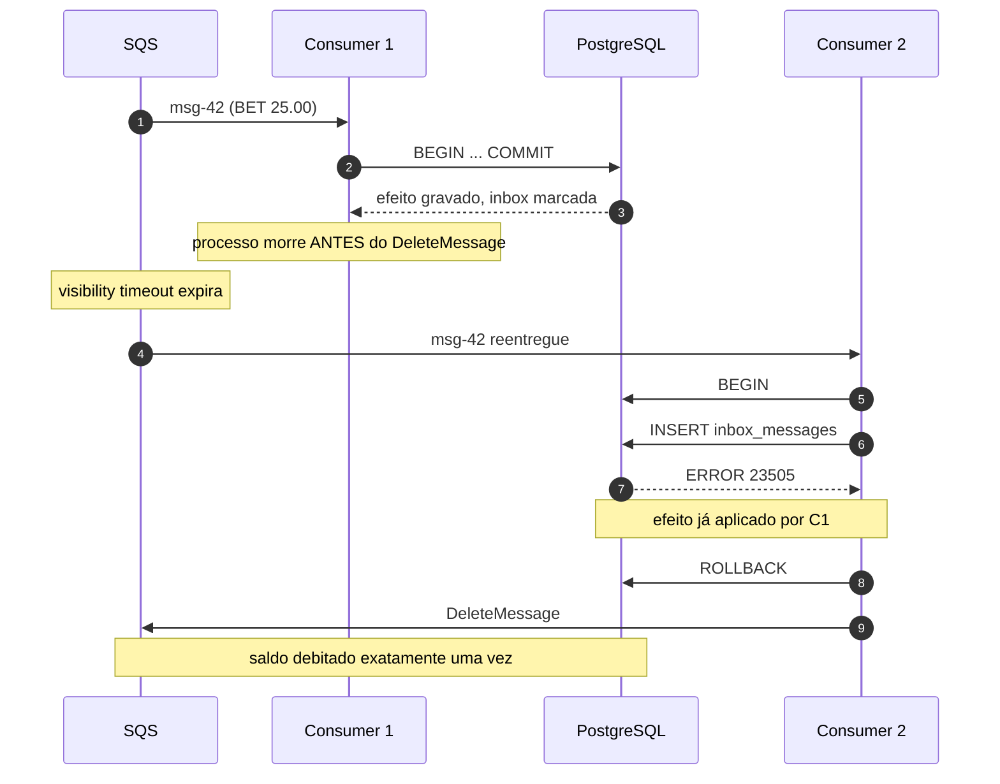
```mermaid
sequenceDiagram
    autonumber
    participant Q as SQS
    participant C1 as Consumer 1
    participant DB as PostgreSQL
    participant C2 as Consumer 2

    Q->>C1: msg-42 (BET 25.00)
    C1->>DB: BEGIN ... COMMIT
    DB-->>C1: efeito gravado, inbox marcada
    Note over C1: processo morre ANTES do DeleteMessage

    Note over Q: visibility timeout expira
    Q->>C2: msg-42 reentregue
    C2->>DB: BEGIN
    C2->>DB: INSERT inbox_messages
    DB-->>C2: ERROR 23505
    Note over C2,DB: efeito já aplicado por C1
    C2->>DB: ROLLBACK
    C2->>Q: DeleteMessage

    Note over Q,DB: saldo debitado exatamente uma vez
```

### 9.7 Referência fora de ordem

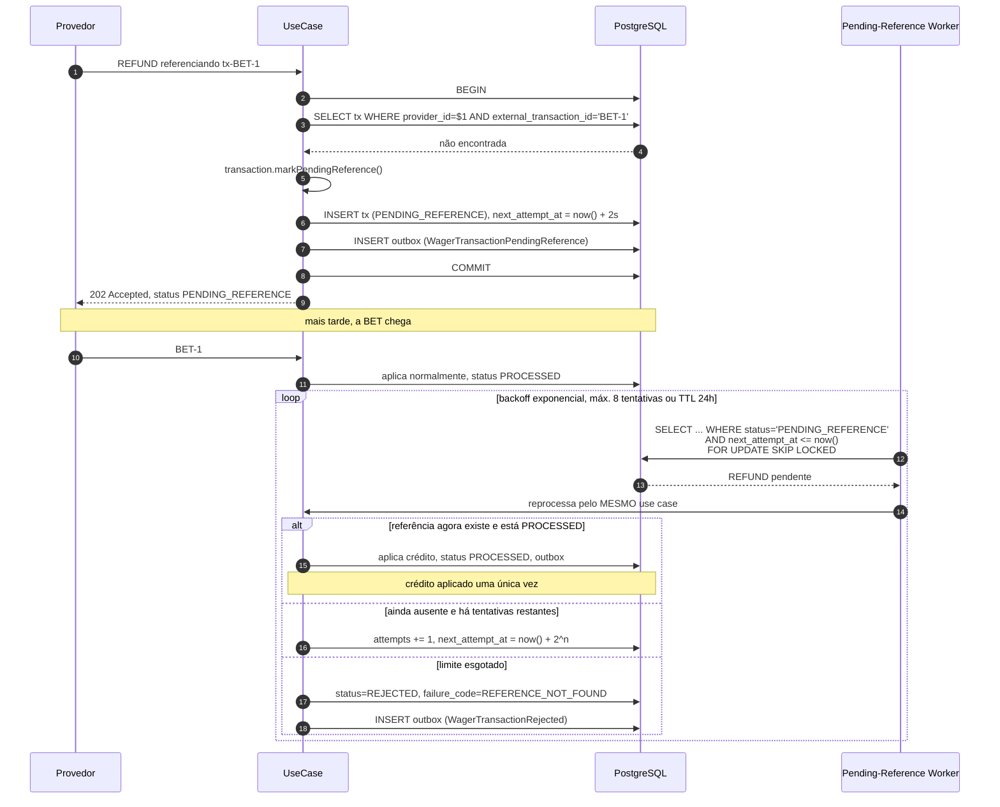
```mermaid
sequenceDiagram
    autonumber
    participant P as Provedor
    participant U as UseCase
    participant DB as PostgreSQL
    participant R as Pending-Reference Worker

    P->>U: REFUND referenciando tx-BET-1
    U->>DB: BEGIN
    U->>DB: SELECT tx WHERE provider_id=$1 AND external_transaction_id='BET-1'
    DB-->>U: não encontrada
    U->>U: transaction.markPendingReference()
    U->>DB: INSERT tx (PENDING_REFERENCE), next_attempt_at = now() + 2s
    U->>DB: INSERT outbox (WagerTransactionPendingReference)
    U->>DB: COMMIT
    U-->>P: 202 Accepted, status PENDING_REFERENCE

    Note over P,DB: mais tarde, a BET chega
    P->>U: BET-1
    U->>DB: aplica normalmente, status PROCESSED

    loop backoff exponencial, máx. 8 tentativas ou TTL 24h
        R->>DB: SELECT ... WHERE status='PENDING_REFERENCE'<br/>AND next_attempt_at <= now()<br/>FOR UPDATE SKIP LOCKED
        DB-->>R: REFUND pendente
        R->>U: reprocessa pelo MESMO use case

        alt referência agora existe e está PROCESSED
            U->>DB: aplica crédito, status PROCESSED, outbox
            Note over U,DB: crédito aplicado uma única vez
        else ainda ausente e há tentativas restantes
            U->>DB: attempts += 1, next_attempt_at = now() + 2^n
        else limite esgotado
            U->>DB: status=REJECTED, failure_code=REFERENCE_NOT_FOUND
            U->>DB: INSERT outbox (WagerTransactionRejected)
        end
    end
```

**Justificativa da retenção em vez de rejeição imediata.** Entrega fora de ordem é
comportamento esperado do canal, não erro do provedor. Rejeitar de imediato
transformaria uma característica conhecida da infraestrutura em falha de negócio,
e forçaria o provedor a implementar sua própria fila de reordenação.

**Justificativa do limite finito.** Reter indefinidamente deixaria a operação sem
desfecho, impedindo a conciliação do provedor. Oito tentativas com backoff `2^n`
cobrem cerca de 34 minutos de atraso, ordem de grandeza acima do redelivery normal
do SQS; o TTL de 24h é o corte operacional a partir do qual a divergência deixa de
ser problema de entrega e passa a ser problema de dados.

### 9.8 Outbox com publishers concorrentes

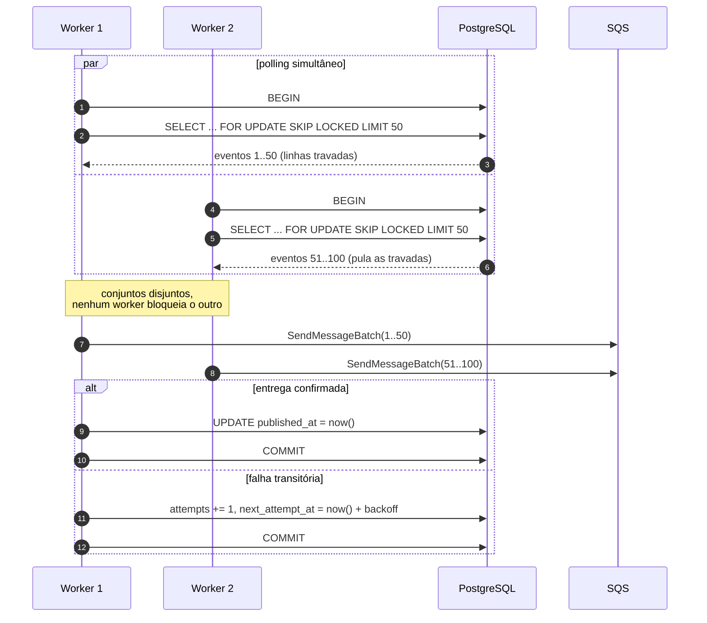
```mermaid
sequenceDiagram
    autonumber
    participant W1 as Worker 1
    participant W2 as Worker 2
    participant DB as PostgreSQL
    participant Q as SQS

    par polling simultâneo
        W1->>DB: BEGIN
        W1->>DB: SELECT ... FOR UPDATE SKIP LOCKED LIMIT 50
        DB-->>W1: eventos 1..50 (linhas travadas)
    and
        W2->>DB: BEGIN
        W2->>DB: SELECT ... FOR UPDATE SKIP LOCKED LIMIT 50
        DB-->>W2: eventos 51..100 (pula as travadas)
    end

    Note over W1,W2: conjuntos disjuntos,<br/>nenhum worker bloqueia o outro

    W1->>Q: SendMessageBatch(1..50)
    W2->>Q: SendMessageBatch(51..100)

    alt entrega confirmada
        W1->>DB: UPDATE published_at = now()
        W1->>DB: COMMIT
    else falha transitória
        W1->>DB: attempts += 1, next_attempt_at = now() + backoff
        W1->>DB: COMMIT
    end
```

**Justificativa do `SKIP LOCKED`.** Sem ele, W2 ficaria bloqueado esperando W1 e a
publicação seria efetivamente serial, anulando a escala horizontal do worker. Com
lock global ou eleição de líder, apenas um worker trabalharia por vez e a solução
seria correta somente com uma instância — uma das falhas eliminatórias do enunciado.

**Sobre duplicação.** Publicar e morrer antes do `UPDATE published_at` republica o
evento. Isso é aceito e documentado: a garantia é at-least-once, o `eventId` é
estável entre republicações, e o consumidor deduplica por ele. Entrega exactly-once
de ponta a ponta não é obtenível sem transação distribuída com o broker.

### 9.9 Reconciliação

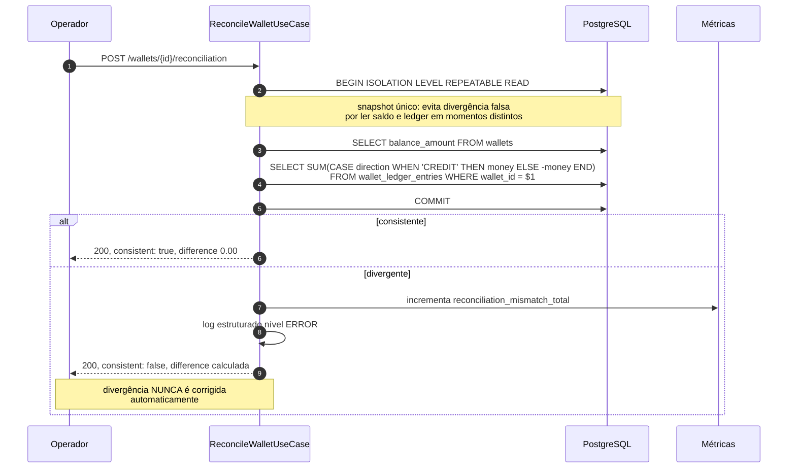
```mermaid
sequenceDiagram
    autonumber
    participant O as Operador
    participant U as ReconcileWalletUseCase
    participant DB as PostgreSQL
    participant M as Métricas

    O->>U: POST /wallets/{id}/reconciliation
    U->>DB: BEGIN ISOLATION LEVEL REPEATABLE READ
    Note over U,DB: snapshot único: evita divergência falsa<br/>por ler saldo e ledger em momentos distintos
    U->>DB: SELECT balance_amount FROM wallets
    U->>DB: SELECT SUM(CASE direction WHEN 'CREDIT' THEN money ELSE -money END)<br/>FROM wallet_ledger_entries WHERE wallet_id = $1
    U->>DB: COMMIT

    alt consistente
        U-->>O: 200, consistent: true, difference 0.00
    else divergente
        U->>M: incrementa reconciliation_mismatch_total
        U->>U: log estruturado nível ERROR
        U-->>O: 200, consistent: false, difference calculada
        Note over U,O: divergência NUNCA é corrigida<br/>automaticamente
    end
```

**Justificativa do isolamento `REPEATABLE READ`.** Sob `READ COMMITTED`, a leitura do
saldo e a agregação do ledger enxergariam snapshots diferentes se uma transação
commitasse entre as duas consultas — produzindo divergência falsa. O snapshot único
elimina esse falso positivo, que seria especialmente nocivo por disparar alarme de
inconsistência financeira sem que exista inconsistência.

**Justificativa de não corrigir.** Ajustar o saldo automaticamente mascararia o bug
que causou a divergência e destruiria a evidência necessária para diagnosticá-lo. A
divergência é sinal, não ruído.

### 9.10 Graceful shutdown

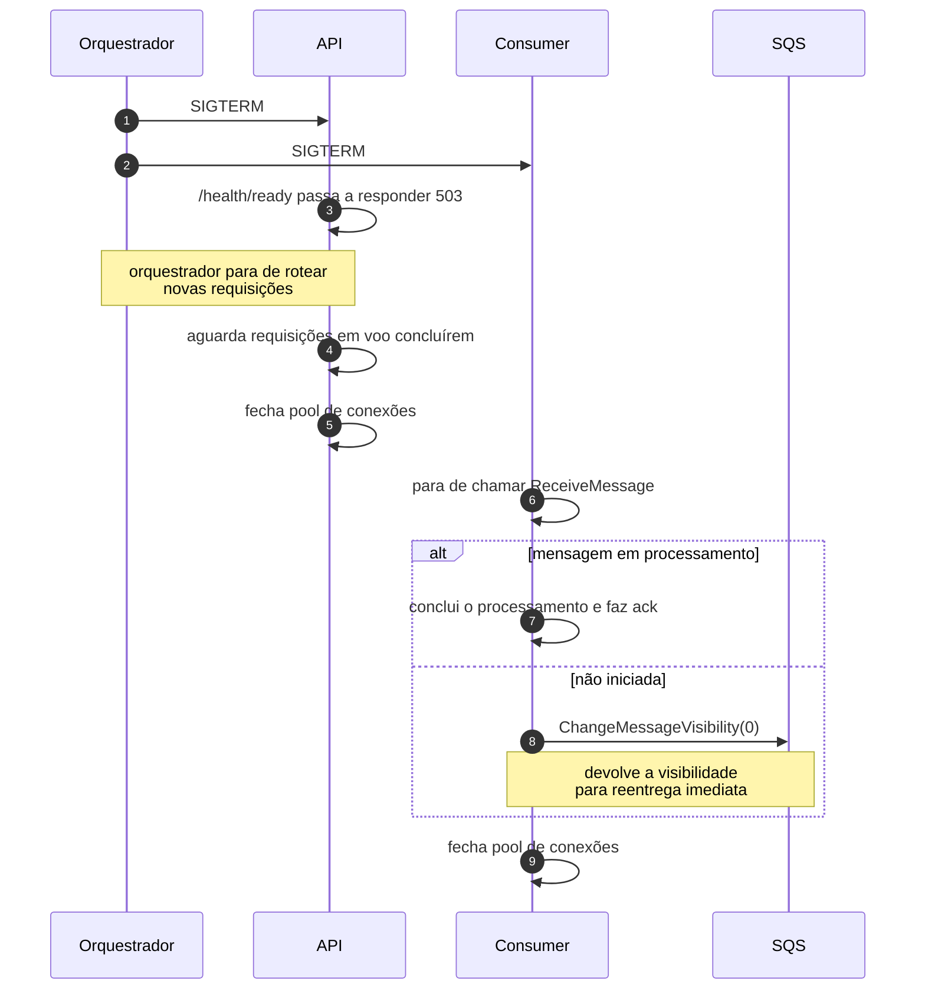
```mermaid
sequenceDiagram
    autonumber
    participant K as Orquestrador
    participant A as API
    participant C as Consumer
    participant Q as SQS

    K->>A: SIGTERM
    K->>C: SIGTERM

    A->>A: /health/ready passa a responder 503
    Note over K,A: orquestrador para de rotear<br/>novas requisições
    A->>A: aguarda requisições em voo concluírem
    A->>A: fecha pool de conexões

    C->>C: para de chamar ReceiveMessage
    alt mensagem em processamento
        C->>C: conclui o processamento e faz ack
    else não iniciada
        C->>Q: ChangeMessageVisibility(0)
        Note over C,Q: devolve a visibilidade<br/>para reentrega imediata
    end
    C->>C: fecha pool de conexões
```

**Justificativa da devolução de visibilidade.** Deixar a mensagem expirar por timeout
funcionaria, mas manteria a operação parada pelo tempo do visibility timeout. Zerar a
visibilidade explicitamente devolve a mensagem para outra instância imediatamente,
reduzindo a latência de recuperação durante um deploy.

---

## 10. Decisões arquiteturais

Cada decisão segue o mesmo formato: contexto, decisão, justificativa, consequências
aceitas e alternativas descartadas com o motivo da rejeição.

### ADR-001 — Arquitetura hexagonal com DDD tático

**Contexto.** O núcleo de risco do sistema é um conjunto pequeno de regras
financeiras densas. O enunciado avalia explicitamente "invariantes encapsuladas em
classes, boundaries, portas, simplicidade".

**Decisão.** Domínio puro no centro, portas declaradas na camada de aplicação,
adaptadores na infraestrutura. Regra de lint proíbe importar `@nestjs/*` e `typeorm`
dentro de `src/domain`.

**Justificativa.** As regras financeiras ficam testáveis sem banco, sem container e
sem framework, o que permite cobri-las exaustivamente com testes instantâneos. Como
essas regras concentram a maior parte do risco, o retorno da separação é
desproporcional ao custo.

**Consequências aceitas.** Mappers explícitos entre entidade de persistência e
agregado de domínio; mais arquivos; duplicação aparente entre `WalletEntity` e
`Wallet`.

**Descartado.** *Active Record com entidades do ORM como domínio* — acopla a
invariante financeira ao ciclo de vida do ORM e torna impossível testar a regra sem
banco. *Camada de serviço anêmica sobre entidades sem comportamento* — dispersa as
invariantes por serviços, que é exatamente o que o enunciado penaliza.

### ADR-002 — Monólito modular com papéis selecionáveis por processo

**Contexto.** É necessário demonstrar correção com três ou mais instâncias, com
papéis de carga distintos: HTTP, consumo de fila e workers de background.

**Decisão.** Uma única imagem, com `APP_ROLE` ∈ {`api`, `consumer`, `worker`}
selecionando quais módulos são inicializados.

**Justificativa.** Preserva a exigência de que HTTP e SQS compartilhem o mesmo caso
de uso, e ao mesmo tempo permite escalar cada papel independentemente. Evita que um
`SIGTERM` destinado a drenar conexões HTTP interrompa a publicação de eventos.

**Consequências aceitas.** Imagem maior que a estritamente necessária por papel;
configuração precisa validar que o papel é conhecido no bootstrap.

**Descartado.** *Processo único acumulando os três papéis* — impede escalar
separadamente e acopla ciclos de vida. *Microsserviços por contexto* — fragmentaria a
fronteira transacional entre wallet, ledger, inbox e outbox, exigindo coordenação
distribuída para obter o que uma transação SQL entrega diretamente.

### ADR-003 — NestJS

**Contexto.** Exigido pelo enunciado.

**Decisão.** NestJS como framework de composição, restrito às camadas de interface e
infraestrutura.

**Justificativa.** O container de injeção de dependência do Nest é o mecanismo que
materializa as portas do ADR-001 sem código de fiação manual. O ciclo de vida
(`OnModuleInit`, `OnApplicationShutdown`) cobre diretamente o requisito de shutdown
gracioso.

**Consequências aceitas.** Decorators e metadata em interface e infraestrutura.

**Nota de contenção.** `@nestjs/event-emitter` está proibido no projeto. Ele publica
em processo e no momento da chamada, o que violaria a exigência de não publicar
eventos antes do commit. Todo evento passa pelo outbox.

### ADR-004 — Bun como runtime e test runner

**Contexto.** Exigido pelo enunciado.

**Decisão.** Bun 1.x para execução, gerenciamento de pacotes e execução de testes.

**Justificativa.** O runner nativo elimina uma camada de configuração de
transpilação, e o tempo de inicialização baixo é relevante nos testes de
concorrência, que sobem múltiplos processos reais.

**Consequências aceitas.** Ecossistema de instrumentação menos maduro que o do
Node.js; k6 permanece como binário externo, invocado por script.

### ADR-005 — TypeORM

**Contexto.** O enunciado permite TypeORM ou MikroORM, marcando o segundo como
preferencial e exigindo justificativa da escolha.

**Decisão.** TypeORM, com `DataSource.transaction()` como unidade de trabalho e
`lock: { mode: 'pessimistic_write' }` para a serialização por wallet.

**Justificativa.** A ausência de Unit of Work e Identity Map, que normalmente é
apontada como limitação, aqui é a propriedade desejada. Numa transação que grava
transação, saldo, ledger, inbox e outbox em ordem controlada, cada escrita ser um
comando explícito no momento em que é escrita elimina a categoria inteira de bug de
"flush ocorreu em momento diferente do esperado". Entidades anêmicas mapeadas por
mapper explícito também tornam trivialmente verificável que o domínio não conhece o
ORM.

**Consequências aceitas.** Mapeamento manual entre entidade e agregado; controle
transacional propagado explicitamente via `EntityManager` para os repositórios, em
vez de contexto implícito.

**Descartado.** *MikroORM* — o Unit of Work implícito exige raciocinar sobre quando o
flush ocorre dentro de uma transação de cinco escritas ordenadas, e o ganho de
automação não compensa a perda de previsibilidade neste caso específico. *Prisma* —
fora de escopo pelo enunciado.

**Armadilhas específicas endereçadas.**

| Armadilha | Tratamento |
|---|---|
| `repository.save()` faz `SELECT` antes e reintroduz a janela TOCTOU | `insert()` explícito no caminho de idempotência |
| `@VersionColumn` incrementa a cada `save()` | Coluna comum; `version` é incrementada pelo domínio apenas quando o saldo muda |
| `lock` fora de transação lança em runtime | Lock sempre dentro de `DataSource.transaction()` |
| `FOR UPDATE` com `leftJoin` gera SQL inválido no PostgreSQL | Wallet carregada sem relações |
| `synchronize: true` destruiria as constraints manuais | Desabilitado; schema exclusivamente por migration |

### ADR-006 — PostgreSQL como árbitro final das invariantes

**Contexto.** N instâncias sem coordenação entre si executam a mesma regra. O
enunciado exige que unicidade, imutabilidade e não-negatividade estejam no schema.

**Decisão.** Toda invariante crítica é expressa como constraint, índice único parcial
ou rule, além de existir no domínio.

**Justificativa.** Validação em código de aplicação é uma afirmação sobre um
processo; constraint é uma afirmação sobre o sistema. Sob concorrência real, apenas a
segunda vale. A duplicação entre domínio e schema é intencional: o domínio produz
mensagens de erro úteis no caminho normal, o schema garante que o caminho anormal não
existe.

**Consequências aceitas.** Regras expressas em dois lugares; migrations com SQL cru;
tratamento explícito de `23505` como caminho de negócio.

**Descartado.** *Validar apenas na aplicação* — falha eliminatória declarada.
*Serializable isolation em vez de constraints* — resolveria a corrida ao custo de
falhas de serialização frequentes sob contenção e retry generalizado.

### ADR-007 — Money como objeto de valor imutável com decimal exato

**Contexto.** Proibição explícita de `number`, `float` e `double` para dinheiro.

**Decisão.** `Money` imutável encapsulando um decimal de precisão arbitrária e a
moeda; escala fixa de 2; toda operação retorna nova instância; operação entre moedas
distintas lança erro de domínio. Persistido como `NUMERIC(19,2)` mais `CHAR(3)`.

**Justificativa.** Erro de arredondamento acumulado é a falha mais insidiosa em
sistema financeiro porque não se manifesta em teste unitário simples — aparece após
milhares de operações. Tornar a representação exata por construção elimina a classe
inteira.

**Consequências aceitas.** Conversão explícita de e para string em toda fronteira;
comparações exigem verificação de moeda.

**Descartado.** *Inteiro em centavos* — funciona para aritmética, mas perde a moeda e
exige convenção implícita de escala espalhada pelo código. *Tipos monetários do ORM* —
acoplaria o domínio à infraestrutura, violando o ADR-001.

### ADR-008 — Saldo materializado com ledger como prova

**Contexto.** A consulta de saldo é a operação mais frequente e é usada para decidir
se uma aposta é autorizada. O ledger precisa ser auditável.

**Decisão.** Saldo materializado em `wallets.balance_amount`; ledger como trilha
imutável que deve reconstruí-lo exatamente.

**Justificativa.** Calcular o saldo por agregação a cada aposta faria o custo crescer
linearmente com o histórico da wallet, degradando justamente os jogadores mais
ativos. A duplicação é o preço da leitura em tempo constante, e a reconciliação é o
mecanismo que a mantém honesta.

**Consequências aceitas.** Duas representações que podem divergir por bug; endpoint
de reconciliação torna-se obrigatório; toda alteração precisa manter as duas na mesma
transação.

**Descartado.** *Saldo puramente derivado do ledger* — custo crescente e sem
mecanismo de verificação independente, já que não haveria com o que comparar.
*Snapshots periódicos* — complexidade de janela sem ganho nesta escala.

### ADR-009 — Pessimistic locking por wallet

**Contexto.** A unidade de concorrência é a `walletId`. O cenário obrigatório é de
alta contenção sobre uma wallet única.

**Decisão.** `SELECT ... FOR UPDATE` na linha da wallet, dentro da transação, antes
de qualquer leitura de saldo. `version` incrementada quando o saldo muda, como defesa
em profundidade e para o payload dos eventos.

**Justificativa.** Sob alta contenção na mesma wallet, optimistic locking degrada
severamente: com 50 requisições concorrentes, aproximadamente 49 falham por conflito
de versão e entram em retry, produzindo avalanche e latência de cauda longa. O
pessimistic transforma a contenção em fila ordenada, com custo previsível. Wallets
distintas não competem entre si, o que satisfaz a proibição de lock global.

**Consequências aceitas.** A vazão de uma wallet única é limitada pela duração da
transação; operações sobre a mesma wallet formam fila. Isso é medido explicitamente
no cenário `hot_wallet` do teste de carga.

**Ausência de deadlock por desenho.** Cada transação financeira trava exatamente uma
linha de `wallets`. `REFUND` e `ROLLBACK` leem a referência, mas a invariante de
contexto garante que ela pertence à mesma wallet — nunca há aquisição de dois locks
de wallet, portanto não há ciclo possível.

**Descartado.** *Optimistic com retry limitado* — retry storm sob o cenário
obrigatório. *`UPDATE ... WHERE balance >= x` atômico isolado* — resolve o saldo, mas
não fornece leitura consistente de `balanceBefore` para o lançamento dentro da mesma
transação. *Lock global ou advisory lock único* — serializa o sistema inteiro e é
proibido pelo enunciado. *Confiar em SQS FIFO por `MessageGroupId = walletId`* —
ordena a fila, mas não protege contra a submissão HTTP concorrente nem contra
redelivery; o enunciado explicita que recursos do broker são otimização, não garantia.

### ADR-010 — Idempotência por unique constraint com insert-first

**Contexto.** Entrega at-least-once; a mesma operação pode chegar por HTTP e por SQS
simultaneamente.

**Decisão.** `UNIQUE (provider_id, idempotency_key)`. Fluxo: `INSERT` primeiro,
captura de `23505`, releitura, comparação de `payloadHash`, decisão entre replay e
conflito.

**Justificativa.** Qualquer verificação prévia cria janela TOCTOU. A constraint é
avaliada no momento da escrita, sem janela, independentemente do número de instâncias.

**`payloadHash`.** SHA-256 sobre JSON canônico — chaves ordenadas lexicograficamente,
sem espaços — do subconjunto de negócio: `providerId`, `externalTransactionId`,
`playerId`, `walletId`, `roundId`, `gameId`, `kind`, `money.amount`,
`money.currency`, `referenceExternalTransactionId`. Header e metadados de transporte
ficam de fora, porque variam legitimamente entre reenvios da mesma operação.

**Consequências aceitas.** O caminho de replay atravessa um erro do banco; exige
tradução explícita de `23505` por nome de constraint, já que várias constraints
distintas produzem o mesmo código.

**Descartado.** *Cache em memória* — falha eliminatória declarada; não sobrevive a
reinício nem é compartilhado. *Deduplicação do SQS FIFO* — janela de 5 minutos e não
cobre a entrada HTTP. *Advisory lock por chave* — serializa operações independentes
que apenas compartilham prefixo.

### ADR-011 — Inbox persistente por consumidor

**Contexto.** Redelivery é garantido pelo canal; múltiplos consumidores competem pela
mesma fila.

**Decisão.** `PRIMARY KEY (consumer_name, message_id)`, gravada na mesma transação do
efeito financeiro.

**Justificativa.** O nome do consumidor faz parte da chave porque um mesmo
`messageId` pode legitimamente ser processado por consumidores diferentes com
propósitos diferentes. Gravar na mesma transação é o que torna a deduplicação exata:
não existe estado em que o efeito foi aplicado e a marca não.

**Consequências aceitas.** A tabela cresce indefinidamente e demanda política de
expurgo, não implementada nesta versão e declarada como limitação.

### ADR-012 — Transactional Outbox com `SKIP LOCKED`

**Contexto.** Proibição de publicar antes do commit; exigência de que o worker
funcione com múltiplos publishers concorrentes.

**Decisão.** Evento gravado na mesma transação do efeito; publicação por worker
separado com `FOR UPDATE SKIP LOCKED` em lotes; backoff exponencial em `attempts` e
`next_attempt_at`.

**Justificativa.** É o único desenho que satisfaz simultaneamente "não publicar antes
do commit" e "não perder evento após o commit". Publicar depois do commit sem
registro prévio perderia o evento se o processo morresse no intervalo — cenário
explicitamente exigido pelo enunciado.

**Consequências aceitas.** At-least-once com possibilidade de republicação; latência
de publicação limitada pelo intervalo de polling; consumidores precisam deduplicar
por `eventId`.

**Descartado.** *Publicação síncrona no caso de uso* — falha eliminatória.
*Change Data Capture sobre o WAL* — resolveria elegantemente ao custo de
infraestrutura adicional desproporcional ao escopo. *`LISTEN/NOTIFY` para acordar o
worker* — reduz latência, mas não substitui o polling, porque a notificação é perdida
se nenhum worker estiver escutando no momento; permanece como otimização futura.

### ADR-013 — Eventos como classes tipadas e versionadas

**Contexto.** O envelope precisa ser estável, versionável e serializável.

**Decisão.** Classe abstrata `IntegrationEvent<T>` com `eventType` e `version`
declarados na subclasse concreta; `data` carrega `MoneyProps` como string decimal,
nunca instância de `Money`.

**Justificativa.** Colocar `eventType` no tipo, e não como string no call site, torna
impossível publicar um evento com tipo divergente do seu payload — erro que só
apareceria no consumidor, em produção. Serializar `Money` como string preserva a
exatidão através da fronteira JSON, onde um número perderia precisão silenciosamente.

**Descartado.** *Objetos literais com `eventType` string* — sem verificação de
correspondência entre tipo e payload. *Serializar o objeto de domínio diretamente* —
acopla o contrato externo à representação interna.

### ADR-014 — Taxonomia explícita de `failureCode`

**Contexto.** O enunciado exige código estável e legível por máquina, suficiente para
o provedor decidir entre reenviar, corrigir ou desistir.

**Decisão.** Taxonomia fechada, com separação deliberada entre situações que um
código genérico agruparia.

| Código | Situação | Ação esperada do provedor |
|---|---|---|
| `INSUFFICIENT_FUNDS` | `BET` sem saldo | desistir |
| `REVERSAL_WOULD_OVERDRAW` | reversão de `WIN` já consumido | escalar — inconsistência operacional |
| `REFERENCE_NOT_FOUND` | referência não chegou no TTL | reenviar a referência |
| `REFERENCE_ALREADY_REVERSED` | segunda reversão do mesmo tipo | desistir |
| `REFERENCE_KIND_NOT_REVERSIBLE` | `REFUND` de `WIN`, `ROLLBACK` de `ROLLBACK` | corrigir payload |
| `REFERENCE_AMOUNT_MISMATCH` | valor diferente da referência | corrigir payload |
| `REFERENCE_CONTEXT_MISMATCH` | provider, player, wallet, moeda ou rodada divergem | corrigir payload |
| `REFERENCE_NOT_PROCESSED` | referência existe mas está `REJECTED` | desistir |
| `CURRENCY_MISMATCH` | moeda diferente da wallet | corrigir payload |
| `WALLET_NOT_FOUND` | wallet inexistente | corrigir payload |
| `PLAYER_WALLET_MISMATCH` | jogador não é titular da wallet | corrigir payload |
| `INTERNAL_KIND_NOT_ALLOWED` | tentativa de submeter `OPENING` | desistir |

**Justificativa da separação entre `INSUFFICIENT_FUNDS` e `REVERSAL_WOULD_OVERDRAW`.**
Exigida explicitamente pelo enunciado, e com razão: a primeira é fluxo normal e
frequente; a segunda significa que um prêmio foi creditado, consumido pelo jogador e
depois estornado — inconsistência operacional que demanda intervenção humana. Um
alarme sobre a segunda é acionável; sobre a primeira, seria ruído constante.

### ADR-015 — Mapeamento de status HTTP por natureza da recusa

**Contexto.** O enunciado exige distinguir com clareza payload inválido, conflito de
idempotência, rejeição de negócio, aceite pendente e falha transitória.

**Decisão.**

| Situação | Status | Decisão do provedor |
|---|---|---|
| Processada agora | `201` | nada a fazer |
| Replay idêntico | `200` com `idempotentReplay: true` | nada a fazer |
| Aceita, aguardando referência | `202` | aguardar, não reenviar |
| Payload inválido | `400` | corrigir e reenviar |
| Conflito de idempotência ou wallet duplicada | `409` | corrigir payload ou usar nova chave |
| Rejeição por regra de negócio | `422` com `failureCode` | não reenviar sem mudar a situação |
| Infra indisponível | `503` com `Retry-After` | reenviar com a mesma chave |

**Justificativa.** O critério é que o provedor decida a ação apenas pelo status, sem
interpretar mensagem de erro. Colapsar rejeição de negócio em `400` obrigaria o
integrador a fazer parsing de texto para saber se pode reenviar — que é exatamente o
que o enunciado aponta como problema.

**Descartado.** *`200` para toda rejeição com desfecho no corpo* — clientes HTTP
genéricos tratam `2xx` como sucesso em camadas de retry e logging.

### ADR-016 — Paginação por cursor opaco no ledger

**Contexto.** O ledger é imutável e cresce continuamente; auditoria percorre volumes
grandes.

**Decisão.** Cursor opaco em base64 sobre `(created_at, id)`, ordenação decrescente,
sem contagem total, limite padrão 50 e máximo 100.

**Justificativa.** `OFFSET` produz varredura crescente e janelas instáveis sob
inserção concorrente — em uma tabela append-only sob carga, páginas profundas
repetiriam ou pulariam lançamentos. O desempate por `id` garante ordem total mesmo
entre lançamentos com o mesmo `created_at`.

**Consequências aceitas.** Não há salto para página arbitrária; ausência de contagem
total.

### ADR-017 — Autenticação: guard no-op com ponto de extensão declarado

**Contexto.** O enunciado deixa a autenticação a cargo do candidato, declara que ela
não pontua e aceita explicitamente a decisão documentada de não implementá-la.

**Decisão.** `ProviderIdentityPort` na camada de aplicação, com implementação
`DeclaredProviderIdentity` que lê o `providerId` sem verificar, e `AuthGuard` no-op
registrado no boundary HTTP. Health checks permanecem abertos por requisito.

**Justificativa.** A costura fica escrita: o caso de uso recebe a identidade pela
porta, nunca do body diretamente. Substituir a implementação por uma que valida token
não altera nenhuma regra de negócio.

**Desenho pretendido, documentado e não implementado.** Keycloak como OIDC provider,
um client por provedor com `client_credentials`, `providerId` derivado do claim `azp`
do token — **nunca do body**.

**Limitação aceita e declarada.** Enquanto a identidade for autodeclarada, qualquer
chamador pode se apresentar como qualquer provedor e movimentar qualquer wallet. A
superfície não deve ser exposta fora de rede confiável. Esta é a limitação mais
severa da entrega e está registrada como tal.

### ADR-018 — SQS FIFO como otimização, nunca como garantia

**Contexto.** O enunciado proíbe confiar apenas em SQS FIFO para consistência.

**Decisão.** `MessageGroupId = walletId` para obter ordenação por wallet e
paralelismo entre wallets; `MessageDeduplicationId` como filtro barato de duplicatas
óbvias. Nenhuma invariante depende desses recursos.

**Justificativa.** A deduplicação do FIFO tem janela de 5 minutos e não cobre a
entrada HTTP. A ordenação por grupo não sobrevive a uma mensagem enviada por outro
canal. Ambos reduzem trabalho no caminho feliz; a correção continua no banco.

### ADR-019 — Observabilidade estruturada com correlação de ponta a ponta

**Contexto.** Requisito explícito de logs estruturados, métricas nomeadas e health
checks separados.

**Decisão.** `AsyncLocalStorage` propaga o `correlationId` da entrada — header HTTP
ou campo do envelope SQS — até o payload do evento publicado. Logs em JSON. Métricas
no formato Prometheus.

**Justificativa.** Sem correlação, diagnosticar uma operação que atravessa HTTP,
banco, outbox e SQS exige juntar logs por timestamp, que é inviável sob concorrência.
`AsyncLocalStorage` evita passar o identificador como parâmetro em toda assinatura,
o que poluiria o domínio.

**Métricas expostas.**

```
wager_transactions_total{kind, status, provider}
wager_idempotent_replays_total{provider}
wager_idempotency_conflicts_total{provider}
wager_rejections_total{failure_code}
wallet_lock_wait_seconds            histogram
outbox_pending_total                gauge
outbox_lag_seconds                  gauge
outbox_publish_attempts_total{result}
inbox_duplicates_total{consumer}
sqs_messages_total{result}
sqs_dlq_total
pending_reference_retries_total
reconciliation_mismatch_total
http_request_duration_seconds       histogram
```

**Higiene de log.** Nunca são logados: `payload` completo da transação, `payloadHash`
íntegro, valores monetários fora de contexto agregado. São logados: identificadores,
`kind`, `status`, `failureCode`, duração.

### ADR-020 — Testes contra infraestrutura real

**Contexto.** O enunciado declara falha eliminatória para "testes que substituem
completamente PostgreSQL e SQS por mocks".

**Decisão.** Testcontainers com PostgreSQL e LocalStack reais; testes de concorrência
com paralelismo verdadeiro e múltiplos processos.

**Justificativa.** As garantias sob teste — unicidade sob corrida, `SKIP LOCKED`,
comportamento de `FOR UPDATE`, atomicidade — são exatamente as propriedades que um
mock não possui. Testar `FOR UPDATE` contra um duplo de teste verifica que o método
foi chamado, não que a serialização ocorreu.

**Consequências aceitas.** Suíte mais lenta; containers compartilhados por suíte para
reduzir custo de inicialização; testes de concorrência repetidos para reduzir a
chance de aprovação acidental.

---

## 11. Concorrência

### 11.1 Unidade de concorrência

A `walletId` é a unidade. O paralelismo entre wallets é total; a serialização dentro
de uma wallet é completa.

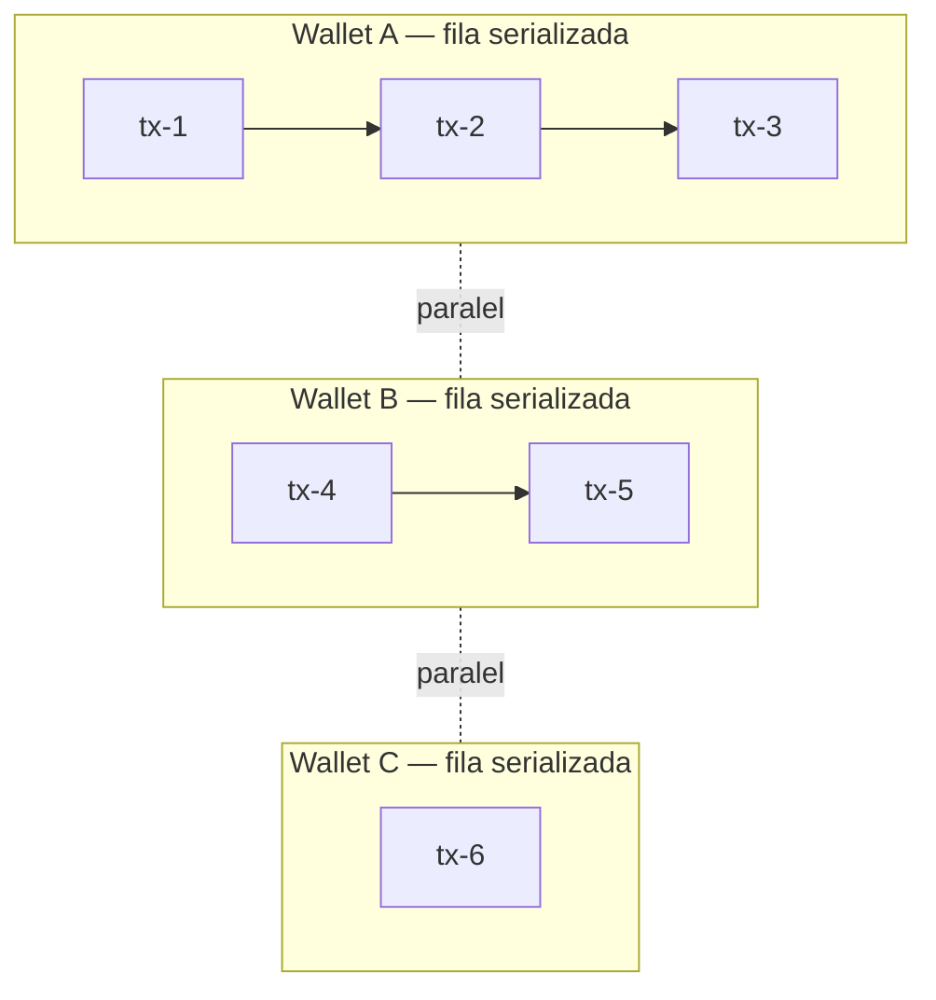
```mermaid
flowchart TB
    subgraph W1["Wallet A — fila serializada"]
        A1[tx-1] --> A2[tx-2] --> A3[tx-3]
    end
    subgraph W2["Wallet B — fila serializada"]
        B1[tx-4] --> B2[tx-5]
    end
    subgraph W3["Wallet C — fila serializada"]
        C1[tx-6]
    end
    W1 -.paralelo.- W2
    W2 -.paralelo.- W3
```

### 11.2 Matriz de proteção

| Corrida | Proteção | Camada |
|---|---|---|
| Dois débitos concorrentes na mesma wallet | `SELECT ... FOR UPDATE` | banco |
| Saldo negativo por qualquer caminho | `CHECK (balance_amount >= 0)` | banco |
| Mesma idempotency key inserida duas vezes | `UNIQUE (provider_id, idempotency_key)` | banco |
| Dois lançamentos para a mesma transação e wallet | `UNIQUE (transaction_id, wallet_id)` | banco |
| Duas reversões concorrentes da mesma referência | índice único parcial | banco |
| Mesma mensagem SQS processada duas vezes | `PRIMARY KEY (consumer_name, message_id)` | banco |
| Dois publishers no mesmo evento | `FOR UPDATE SKIP LOCKED` | banco |
| Dois workers no mesmo `PENDING_REFERENCE` | `FOR UPDATE SKIP LOCKED` | banco |
| Duas wallets para o mesmo player e moeda | `UNIQUE (player_id, currency)` | banco |
| Lançamento aritmeticamente inconsistente | `CHECK` de aritmética | banco |

Toda linha da matriz é resolvida pelo banco. Nenhuma depende de coordenação entre
instâncias, de ordem de execução ou de estado em memória — é isso que torna a solução
correta com N instâncias.

### 11.3 Cenário obrigatório

Saldo inicial 100.00, duas apostas de 80.00 simultâneas. Resultado garantido: uma
`PROCESSED`, uma `REJECTED` por `INSUFFICIENT_FUNDS`, saldo final 20.00, exatamente
um lançamento `DEBIT`, nenhum retry duplicando o débito. Sequência detalhada em 9.4.

---

## 12. Idempotência

```mermaid
flowchart TD
    START([Requisição chega]) --> HASH[Calcula payloadHash<br/>sobre JSON canônico]
    HASH --> INS[INSERT wager_transactions]
    INS --> OK{Inseriu?}

    OK -->|sim| PROC[Processa normalmente]
    OK -->|não, 23505| SEL[SELECT transação existente]

    SEL --> CMP{payloadHash confere?}
    CMP -->|sim| ST{status}
    CMP -->|não| CONF[409 IDEMPOTENCY_PAYLOAD_CONFLICT]

    ST -->|PROCESSED| REP[200 com resultado original<br/>e saldo histórico do ledger]
    ST -->|REJECTED| REPR[422 com failureCode original]
    ST -->|PENDING_REFERENCE| REPP[202 PENDING_REFERENCE]
    ST -->|PENDING| WAIT[409 ou 503 — em processamento]

    PROC --> DONE([201])
```

**Três camadas independentes.** Idempotência de negócio pela chave por provedor;
idempotência de transporte pela inbox por mensagem; idempotência de saída pelo
`eventId` estável, deduplicado no consumidor. Nenhuma depende das outras.

**O caso `PENDING`.** Uma transação em `PENDING` significa que outra requisição está
processando a mesma chave neste instante. Devolver `409` ou `503` com `Retry-After` é
preferível a bloquear, porque a espera pode se estender indefinidamente e o provedor
pode ter timeout mais curto que o nosso.

---

## 13. Mensageria

```mermaid
flowchart LR
    PROV[Provedor] -->|publica| IN[wager-transactions.fifo]
    IN --> CONS[Consumer]
    CONS -->|malformado ou<br/>tentativas esgotadas| DLQ[wager-transactions-dlq.fifo]
    CONS -->|válido| UC[UseCase]
    UC --> DB[(PostgreSQL)]
    DB -->|outbox| WRK[Outbox Worker]
    WRK --> OUT[wager-events]
    OUT --> EXT[Consumidores externos]
```

### 13.1 Classificação de erro no consumo

| Classe | Exemplos | Ação | Ack |
|---|---|---|---|
| Negócio | saldo insuficiente, referência já revertida, moeda divergente | persiste `REJECTED`, emite evento | sim |
| Transitório | banco indisponível, timeout, deadlock | não confirma, deixa reentregar com backoff | não |
| Permanente | JSON inválido, campo obrigatório ausente, `kind` desconhecido | encaminha à DLQ | sim |

**Justificativa do ack em erro de negócio.** Reprocessar produziria exatamente a
mesma rejeição indefinidamente, ocupando a fila e consumindo o orçamento de
tentativas até a DLQ — poluindo a DLQ com mensagens que não têm defeito algum.

### 13.2 Parâmetros

| Parâmetro | Valor | Justificativa |
|---|---|---|
| Visibility timeout | 30 s | Acima do p99 de processamento com folga para pausa de GC |
| `maxReceiveCount` | 5 | Cobre indisponibilidades curtas sem reter mensagem defeituosa por muito tempo |
| Long polling | 20 s | Máximo do SQS; reduz chamadas vazias e custo |
| Batch de recebimento | 10 | Máximo do SQS |
| Backoff do outbox | `2^attempts` s, teto 5 min | Recuperação rápida em falha curta, sem martelar canal em queda longa |
| `maxAttempts` do outbox | 10 | Cobre cerca de 8 h de indisponibilidade acumulada |
| Retry de `PENDING_REFERENCE` | `2^n` s, máx. 8 tentativas ou TTL 24 h | Cerca de 34 min de tolerância a desordem; 24 h como corte operacional |

---

## 14. Observabilidade

### 14.1 Health checks

| Endpoint | Verifica | Falha quando |
|---|---|---|
| `GET /health/live` | processo responde | apenas em shutdown |
| `GET /health/ready` | `SELECT 1` no PostgreSQL e `GetQueueAttributes` no SQS | qualquer dependência inacessível |

**Justificativa da separação.** Liveness que verifica dependências causa reinício em
cascata: banco cai, todas as instâncias são consideradas mortas, todas reiniciam
simultaneamente e a recuperação do banco enfrenta uma tempestade de conexões.
Readiness apenas remove a instância do roteamento até que a dependência volte.

### 14.2 Alarmes

| Condição | Severidade | Razão |
|---|---|---|
| `reconciliation_mismatch_total > 0` | crítico | divergência entre saldo e ledger |
| `outbox_lag_seconds > 60` por 5 min | alto | eventos represados |
| `sqs_dlq_total` crescendo | alto | mensagens irrecuperáveis |
| `wager_rejections_total{failure_code="REVERSAL_WOULD_OVERDRAW"} > 0` | alto | inconsistência operacional real |
| `wallet_lock_wait_seconds` p99 acima do baseline | médio | hot wallet degradando |

`INSUFFICIENT_FUNDS` deliberadamente **não** gera alarme: é fluxo normal e frequente.

### 14.3 Métricas, dashboards e tracing

Logs estruturados em JSON com `correlationId` propagado por `AsyncLocalStorage`
(sem precisar passá-lo por parâmetro em cada função). Métricas via `MetricsPort`
(porta) e `PrometheusMetricsAdapter` (`prom-client`), cobrindo transações por
tipo/status/provedor, replays e conflitos de idempotência, rejeições por
`failureCode`, latência HTTP e publicação do outbox.

As roles `consumer` e `worker` não têm servidor HTTP próprio, então cada uma
sobe um servidor HTTP mínimo só para expor `/metrics` (`METRICS_PORT`, padrão
`9464`); a role `api` expõe no mesmo servidor Nest, porta `3000`.

Tracing distribuído via OpenTelemetry, com instrumentação automática de `http`
e `pg` (`@opentelemetry/instrumentation-http`/`-pg`), exportando via OTLP.
`docker-compose.yml` sobe Prometheus, Grafana e Tempo pré-configurados junto
com a aplicação — scrape config, datasources e um dashboard já provisionados,
sem passo manual.

---

## 15. Estratégia de testes

| Camada | Foco | Infraestrutura |
|---|---|---|
| Unitário | `Money`, invariantes de `Wallet`, transições de `WagerTransaction`, aritmética do ledger, canonicalização do hash | nenhuma |
| Integração | migrations, constraints, atomicidade, inbox, redelivery, publishers concorrentes, retry, DLQ, recuperação após reinício | PostgreSQL e LocalStack reais |
| Concorrência | corridas com paralelismo verdadeiro | PostgreSQL e LocalStack reais, múltiplos processos |
| Contrato | todos os status de cada endpoint | aplicação completa |

### 15.1 Cenários de concorrência

| # | Cenário | Critério |
|---|---|---|
| 1 | Mesma aposta 50× em paralelo | exatamente um débito |
| 2 | Saldo 100, duas apostas de 80 | uma `PROCESSED`, uma `REJECTED`, saldo 20, um lançamento |
| 3 | Wallets distintas em paralelo | ausência de espera cruzada |
| 4 | Três ou mais instâncias simultâneas | invariante final preservada |
| 5 | Worker morto após commit, antes do ack | redelivery não duplica |
| 6 | Dois publishers sobre a mesma outbox | nenhum evento duplicado nem perdido |
| 7 | `ROLLBACK` entregue antes da referência | aplicado uma única vez quando resolvido |
| 8 | Reinício do serviço sob carga | consistência final comprovada |
| 9 | Duas reversões concorrentes da mesma referência | exatamente uma aplicada |

### 15.2 Assertion final

Ao término de **todo** teste de integração e concorrência, independentemente do que
o teste verificava:

```
wallet.balance == SUM(CREDIT) − SUM(DEBIT) do ledger
```

**Justificativa.** É a única verificação que detecta uma classe inteira de bugs que
os testes específicos podem não cobrir. Um teste sobre outbox que passe mas deixe o
saldo divergente falha aqui.

---

## 16. Teste de carga

Exposto como `bun run test:load`, que envolve a execução do k6 — um binário Go, não
executado sobre Bun.

### 16.1 Objetivo

O enunciado declara que não há meta de RPS e que a qualidade do experimento pesa mais
que o número bruto. O teste responde três perguntas:

1. Sob contenção real, o saldo permanece correto?
2. Qual o custo da serialização por wallet?
3. O outbox acompanha a escrita ou o lag cresce sem limite?

### 16.2 Cenários

| Cenário | Executor | Alvo | Mede |
|---|---|---|---|
| `distributed` | `constant-arrival-rate` | 500 wallets | vazão do caminho de escrita sem contenção artificial |
| `hot_wallet` | `constant-arrival-rate` | 1 wallet | custo da serialização — o número mais informativo do relatório |
| `replay` | `constant-vus` | chave fixa | latência do caminho de idempotência, como linha de base |

Mix de `distributed`: 50% `BET`, 25% `LOSS`, 20% `WIN`, 5% `REFUND`. Apenas `BET`
esvaziaria as wallets e passaria a medir o caminho de rejeição, que não toca ledger
nem outbox.

### 16.3 Armadilha estrutural

Chave de idempotência única por iteração:

```js
const key = `load-${runId}-${__VU}-${__ITER}`;
```

Se todas as VUs enviarem a mesma chave, a primeira escreve e as demais caem no
caminho de replay — que devolve `200` lendo uma linha existente, sem lock, sem ledger
e sem outbox. O relatório mostraria throughput alto medindo o caminho mais barato do
sistema. O `runId` vem do ambiente para evitar colisão entre execuções.

### 16.4 Classificação de resposta

`422` por `INSUFFICIENT_FUNDS` **não é falha** — é o sistema funcionando. Tratado via
`responseCallback` como esperado e contabilizado em counter separado. Sem isso, a
taxa de erro reportada seria dominada por rejeições legítimas.

### 16.5 Métricas customizadas

```js
const rejectedFunds  = new Counter('biz_rejected_insufficient_funds');
const idempConflicts = new Counter('biz_idempotency_conflicts');
const replays        = new Counter('biz_idempotent_replays');
const lockWait       = new Trend('biz_lock_wait_ms');
const outboxLag      = new Trend('biz_outbox_lag_ms');
```

O outbox lag é amostrado por um cenário de 1 VU raspando `/metrics` a cada segundo.

### 16.6 Thresholds

```js
thresholds: {
  'http_req_duration{scenario:distributed}': ['p(95)<300', 'p(99)<800'],
  'http_req_duration{scenario:hot_wallet}':  ['p(95)<1500'],
  'biz_idempotency_conflicts':               ['count==0'],
  'checks':                                  ['rate>0.99'],
}
```

`biz_idempotency_conflicts == 0` é o único threshold inegociável: com chave única por
iteração, nenhum `409` deveria existir. Se aparecer, há bug de idempotência ou
colisão de `runId`.

### 16.7 Verificação pós-carga

```
para cada wallet tocada: POST /wallets/{id}/reconciliation → consistent == true
outbox pendente drena até zero após o fim da carga
nenhuma transação permanece em PENDING
```

É esta verificação, e não o throughput, que transforma o teste de carga em evidência
de correção. Sob contenção real, é aqui que uma corrida sobrevivente aos testes
determinísticos apareceria.

### 16.8 Registro em `LOAD-TEST.md`

Ambiente, metodologia, throughput, p50/p95/p99, taxa de erro, conflitos de
concorrência e outbox lag — com a ressalva de que o gerador de carga disputa CPU com
o sistema sob teste na mesma máquina, o que torna os números limite inferior e não
extrapoláveis. O objetivo é comparação relativa entre cenários e verificação de
correção sob contenção, não capacidade absoluta.

---

## 17. Limitações conhecidas

Declaradas deliberadamente. Escopo cortado em silêncio parece esquecimento; escopo
cortado com justificativa é priorização.

| # | Limitação | Justificativa | Caminho de evolução |
|---|---|---|---|
| 1 | Identidade do provedor autodeclarada, sem verificação | Não pontua na avaliação; a costura está escrita e isolada | Keycloak com `client_credentials`, `providerId` do claim `azp` |
| 2 | Sem reconciliação periódica automática | Endpoint sob demanda cobre o requisito; automação exige definição de janela e destino de alarme | Job agendado com `SKIP LOCKED` sobre wallets, priorizando as mais movimentadas |
| 3 | Inbox cresce indefinidamente | Política de expurgo exige definição de prazo de retenção | Expurgo por idade acima do visibility timeout com folga |
| 4 | Ledger sem particionamento | Volume atual não justifica; paginação por cursor mantém a consulta constante | Particionamento por período em `created_at` |
| 5 | Sem partidas dobradas | Declarado como diferencial opcional, não requisito | Conta de contrapartida por provedor |
| 6 | Reversão parcial não suportada | Fora de escopo pelo enunciado | Exigiria controlar saldo remanescente por referência |
| 7 | Multi-moeda modelado mas não operado | Redução de escopo; conflitos de moeda são testados | Nenhuma mudança estrutural necessária |
| 8 | Outbox depende de polling | `LISTEN/NOTIFY` reduziria latência mas não substitui o polling, pois a notificação se perde sem ouvinte | Híbrido: notificação como gatilho, polling como rede de segurança |
| 9 | Publicação de eventos é at-least-once | Exactly-once de ponta a ponta exige transação distribuída com o broker | Consumidores deduplicam por `eventId` |
